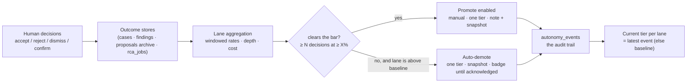

# Autonomy ledger

The **autonomy ledger** answers one question with evidence instead of opinion: *how much
independence has each kind of agent work earned?* Argus already records the outcome of every
supervised decision a human makes about agent output — accepting a triage draft, rejecting a
distilled skill proposal, posting a review finding, confirming an RCA report. The ledger
aggregates those outcomes per **lane**, shows each lane's track record against a **graduation
bar**, and holds an **A0–A6 tier** per lane that is promoted manually on evidence and demoted
automatically when quality dips. A one-click **decision-review report** (the "day-90 pack")
exports the same numbers as a shareable markdown document.

Two design commitments run through everything:

- **Measure and record only (v1).** Tiers are a decision surface, not an enforcement mechanism.
  Changing a lane's tier changes nothing about what the app permits — permission modes, the
  unattended boundary, and the risk table stay where they are. The ledger is how you *justify*
  changing those knobs, and the audit trail of when and why you did.
- **Honest accounting.** Rates are computed only from decisions that carry a real timestamp;
  records from before the feature shipped count in all-time views but never in windows, and the
  report says when honest data began. Cost that cannot be attributed (headless distill/RCA runs
  have no session) is displayed as *unattributed*, never estimated.

- [Part 1 — How it works and where it is useful](#part-1--how-it-works-and-where-it-is-useful)
- [Part 2 — Under the hood](#part-2--under-the-hood)

---

# Part 1 — How it works and where it is useful

## 1.1 The four lanes

A **lane** is a class of agent work whose output a human reviews. Each lane maps onto an outcome
store that already existed; the ledger reads those stores, it does not copy them.

| Lane | What is being decided | Accepted means | Rejected means |
|---|---|---|---|
| **Triage suggestions** | Draft cases produced by routine pre-triage | You accepted the draft (title/tags applied, draft flag cleared) | You dismissed it (case closed while still a draft) |
| **Distill proposals** | Skill/reference/recipe proposals from distillation | Accepted into your library | Rejected, with a reason tag (`overfit`, `overgeneric`, `wrong`, `duplicate`, `other`) |
| **Review findings** | Findings from review-mode sessions | Marked accepted — with **depth** signals for the stronger verbs: *posted* (comment landed on the PR) and *applied* (change pushed) | Marked rejected |
| **RCA reports** | Generated root-cause reports | Confirmed (and optionally posted, per target) | Superseded — regenerated without ever confirming |

Per lane, over a rolling window (30 days by default): **decisions**, **acceptance rate** (always
shown with its denominator — a thin lane reads "insufficient data", never a confident
percentage), **depth** where the lane has it, the **reject-reason mix** for distill (v1's proxy
for rework), and **cost** where attributable.

Two global tiles sit alongside the lanes:

- **Time in triage** — ticket arrival (the Jira issue's `created`, falling back to the case's
  creation) → the first recorded root-cause hypothesis (the earliest finding later assigned
  `role='root-cause'`, falling back to RCA confirmation). Median and p90 over the window.
- **Cost per resolved case** — reused directly from the existing observability metrics.

## 1.2 Tiers, the bar, and the graduation rule

Every lane holds a tier from the autonomy ladder: **A0** (read & answer) up to **A6** (deploy
inside guardrails). Lanes start at a baseline reflecting what Argus does today — review findings
at **A3** (opens branches/PRs, review is the gate), the other lanes at **A1** (analyze &
recommend, human applies).

The **graduation rule**: a lane may be promoted only when its measured, supervised track record
clears a pre-set bar — by default **at least 10 decisions in the window at ≥ 80% acceptance**
(per-lane bars and the window live in `settings.autonomy` in `config/settings.json`). The
Promote button is physically disabled below the bar. Promotion is always manual, one tier at a
time, and always recorded with your note **plus a frozen snapshot of the lane's metrics at that
moment** — so for any tier a lane holds, you can show exactly what evidence justified it.

**Demotion is automatic.** An evaluator runs at boot and shortly after every outcome write. If a
lane sitting *above* its baseline falls below its bar — with enough decisions in the window that
the dip is real, sparse data never demotes — it drops one tier, records an `auto-demote` event
with the incriminating snapshot, and badges the Autonomy icon in the top bar until you
acknowledge it. It fires once per breach: after a demotion it stays quiet until at least one new
decision lands, so one bad week cannot ratchet a lane to A0.



## 1.3 The Autonomy page

The gauge icon in the top bar opens the page (a second click, or Escape, closes it). It shows:

- the three global tiles (time in triage, cost per resolved case, unacknowledged demotions);
- one card per lane — tier badge, windowed metrics with the bar status (`clears bar` /
  `below bar`), depth line, reject-reason mix, Promote/Demote with an inline note box, and the
  lane's event timeline with an **Acknowledge** button on any unacknowledged auto-demotion;
- the report section (below).

The page updates live: any outcome write anywhere in the app (rejecting a proposal, reviewing a
finding, accepting a routine draft, confirming an RCA) broadcasts a refresh.

## 1.4 The decision-review report ("day-90 pack")

**Generate report** assembles the current numbers into a markdown document — lane table,
reject-reason mix, depth, time-in-triage, cost per resolved case, and the full tier history with
its evidence — and writes it to `<ARGUS_HOME>/reports/autonomy-review-<date>.md` (same-day
regeneration overwrites). It is pure data assembly; no model is involved.

**Post to Confluence** publishes it as a page through the same Rovo connector the RCA posting
path uses (space key from **Settings → RCA**). Posting is idempotent: a report that already
posted successfully is never re-posted; failures are recorded next to the file and shown inline.

The report ends with the honesty caveat: *rates are computed from stamped decisions only;
records predating the outcome stamps count all-time but not in windows.*

## 1.5 Where it is useful

- **Quarterly autonomy reviews** — the deck's rule ("autonomy boundaries reviewed against
  metrics, in both directions") becomes a page you open rather than an argument you have.
- **Justifying a real loosening** — before you flip an actual knob (e.g. scheduling a routine
  more aggressively, or trusting distill proposals with less scrutiny), the lane's history is
  the case for it — and the demotion trail is the case against.
- **The day-90 conversation** — acceptance rates, cost per resolved case and time-in-triage are
  exactly the evidence the pilot committed to produce; the report is that commitment,
  exportable.

---

# Part 2 — Under the hood

## 2.1 Architecture: read-side aggregation, one small table

The ledger deliberately owns almost no data. Outcomes stay in their source stores and are
aggregated on read (the `metrics.ts` pattern); the only new persisted state is the
`autonomy_events` table plus three timestamp stamps on existing stores.

| Piece | Where | Role |
|---|---|---|
| Contract | `app/src/shared/autonomy.ts` | Versioned, JSON-serializable types everything consumes: `DecisionRow`, `LaneMetrics`, `AutonomyEventRow`, `AutonomyPayload`; `LANES`, `LANE_BASELINES`, `barFor`, `clearsBar` |
| Lane aggregators | `app/src/main/services/autonomy/lanes.ts` | `listDecisions(lane, window)`, `laneMetrics`, `timeInTriage` — pure SQL/file reads, injectable clock |
| Tier ledger | `app/src/main/services/autonomy/ledger.ts` | `autonomy_events` accessors: `currentTier` (latest event, else baseline), `addEvent` (derives `fromTier`, clamps to A0–A6, rejects no-ops), `ackEvent`, `unackedDemotions` |
| Evaluator | `app/src/main/services/autonomy/evaluator.ts` | The auto-demotion rule; boot pass + 1s-debounced pass after outcome writes; fail-quiet |
| Payload | `app/src/main/services/autonomy/payload.ts` | Assembles `AutonomyPayload` (all lanes + tiles) for IPC and the report |
| Report | `app/src/main/services/autonomy/report.ts` | `renderAutonomyReport(payload)` — **pure**, never touches the DB — plus the file writer |
| Posting | `app/src/main/services/autonomy/post.ts` | Confluence-only posting with sidecar idempotency |
| Instance id | `app/src/main/services/autonomy/instanceId.ts` | Mint-once UUID at `config/instance-id.json` |
| Renderer | `lib/autonomyStore.ts`, `components/autonomy/` | Broadcast-driven store mirror; `AutonomyStandalone` + `LaneCard` |

### The `autonomy_events` table

```
autonomy_events(id, lane, kind, from_tier, to_tier, note,
                metrics_snapshot,        -- JSON: the lane's windowed metrics at decision time
                created_at, acknowledged_at)
```

`kind` ∈ `promote | demote | auto-demote`. The current tier is simply the latest event's
`to_tier` (baseline when a lane has no history). Events are never edited or deleted — the table
*is* the audit trail, and `metrics_snapshot` freezes the evidence so later data drift cannot
rewrite why a decision was made.

### The three outcome stamps (forward-only, no backfill)

The source stores recorded outcomes but not always *when the human decided*. Three stamps close
that, all set-once via `COALESCE`:

| Stamp | Set by | Meaning |
|---|---|---|
| `cases.triaged_at` | routine `acceptItem`/`dismissItem` | First triage decision on a routine draft (first decision wins across windows) |
| `findings.posted_at` / `pushed_at` | `recordFindingWrite` | When a finding's comment landed / its change was pushed |
| `decided:` frontmatter | proposal `archive()` | When a proposal was accepted or rejected |

Old records are **not** backfilled. The window rule is strict: a decision enters a windowed view
only if `decidedAt` is stamped and inside the window; all-time views count everything; the
unstamped never contribute to a lane's "data since" date.

## 2.2 Lane query semantics (the subtle ones)

- **Triage** — population is `origin='routine' AND triaged_at IS NOT NULL`. Rejected means
  *dismissed*, and dismissal has an invariant shape: **closed while still a draft**
  (`review_state IS NOT NULL AND status='closed'`). Outcome is deliberately *not* derived from
  `review_state` alone: a later routine sweep can re-draft a previously accepted case, and
  reading live state would retroactively fabricate rejects — which the evaluator would then
  demote off. (This was the final review's headline finding.)
- **RCA** — a done-but-unconfirmed job is *pending* only while it is the newest for its case;
  once a newer job supersedes it, the old one counts as rejected. Confirmation is acceptance.
- **Review findings** — the lane is scoped by the session's mode (`mode='review'` join); the
  depth counters window on their own stamps, not on `reviewed_at`.
- **Time in triage** — the stop anchor is the `created_at` of the earliest finding *later*
  assigned the root-cause role: the hypothesis existed when the finding was written, the role
  merely labels it. Negative durations (imported tickets, clock skew) are skipped as dirty.

## 2.3 The evaluator's demotion rule, exactly

For each lane, in order — any miss means no action:

1. Current tier must be **above the lane's baseline** (a lane at baseline never auto-demotes).
2. Windowed decisions ≥ `bar.minDecisions` (sparse data never demotes).
3. Windowed acceptance rate < `bar.minAcceptanceRate`.
4. **Single-fire guard:** if the lane's latest `auto-demote` event exists, at least one decision
   must have been stamped strictly after it. Otherwise stay quiet — re-evaluating the same bad
   window forever would ratchet the lane to A0.
5. Insert `auto-demote` to `currentTier − 1` with the metrics snapshot.

It is **fail-quiet**: an aggregation error logs and skips that lane; the evaluator never inserts
an event off partial data and never crashes the app over a metric. It runs once at boot (a dip
that happened while the app was closed is noticed immediately) and on a 1-second trailing
debounce after outcome writes.

## 2.4 IPC surface and the refresh contract

Channels: `autonomy:status`, `:promote`, `:demote`, `:ack`, `:report-generate`, `:report-post`,
and the broadcast `autonomy:changed` (payload-free — listeners re-read; the broadcast never
throws, persistence never depends on renderer liveness).

The six outcome-write handlers (proposals accept/reject, finding review, RCA confirm, routine
accept/dismiss) all call one helper: broadcast `autonomy:changed`, then `evaluateSoon()`. The
renderer's `autonomyStore` (the `proposalsStore` pattern: prime once, refetch on every
broadcast) also refetches on page mount, so the page is never boot-stale.

Handlers validate their arguments: promote/demote reject unknown lanes; promote re-checks the
bar in main (the disabled button is UX, the throw is the contract); `report-post` only accepts
paths inside `<ARGUS_HOME>/reports/` matching `autonomy-review-*.md` (resolved before checking,
so traversal doesn't bypass it).

## 2.5 The telemetry-ready contract

A follow-up will POST this data to an internal server. v1 does not build the uploader, but the
shapes guarantee it stays additive:

- **Row level is preserved.** `listDecisions` returns one `DecisionRow` per decision with a
  stable `sourceId` (finding id / archive filename / case slug / rca job id) and its
  `decidedAt`; `laneMetrics` is computed *from* those rows, never instead of them. A future
  uploader can keep a per-lane watermark cursor (the `routine_cursors` pattern) and ship only
  new rows.
- **Every payload is versioned and identified**: `contractVersion`, `argusVersion`, and a
  stable per-install `instanceId` (minted once into `config/instance-id.json`) so
  multi-workstation data is distinguishable server-side.
- **The report renderer consumes the payload, not the DB** — the page, the report, and the
  future uploader all read the same contract, so none of them can drift from the others.

The uploader itself (endpoint setting, auth via `safeStorage`, cursor store, `telemetrySink.ts`)
is deliberately out of scope for v1.

## 2.6 What v1 deliberately does not do

- **No enforcement.** Tiers do not drive permission modes, the unattended boundary, or the risk
  table.
- **No rework-after-accept tracking** — the distill reject-reason mix is the labeled proxy.
- **No cost estimation** for headless distill/RCA jobs (no session row → *unattributed*).
- **No backfill** of historical outcome timestamps.
- **No escape-rate metric** — there is no in-app signal for defects reaching consumers yet;
  planned to arrive with the verification lane (workstream C), whose outcomes are the objective
  half of future graduation evidence.
- **No window picker in the UI** — the window is `settings.autonomy.windowDays`, and the bars
  are edited in settings JSON.

References: spec `argus-docs/superpowers/specs/2026-08-11-autonomy-ledger-design.md`, plan
`argus-docs/superpowers/plans/2026-08-12-autonomy-ledger.md`, shipped in PR #148.
