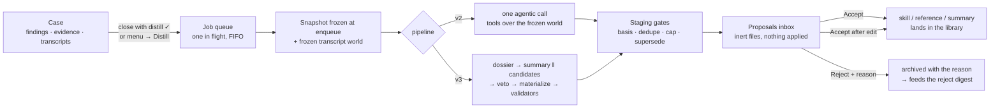
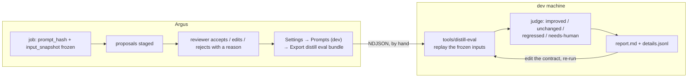
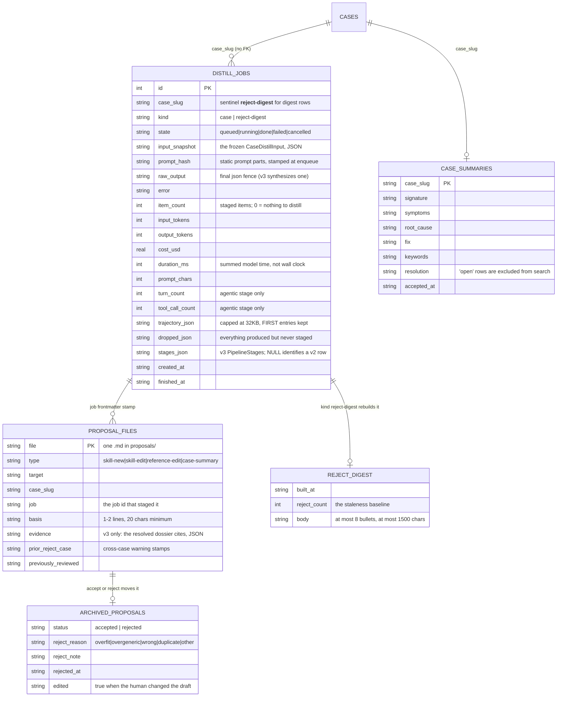
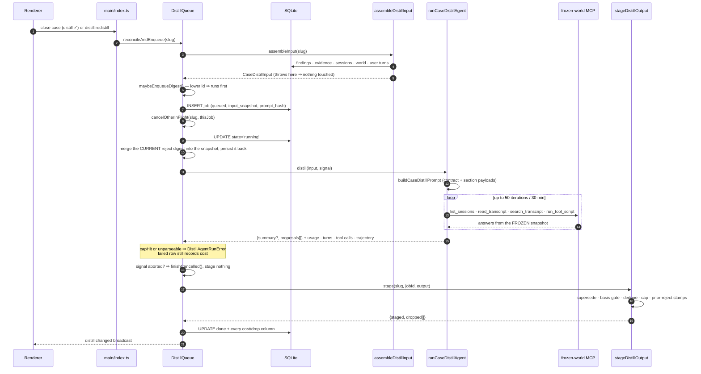
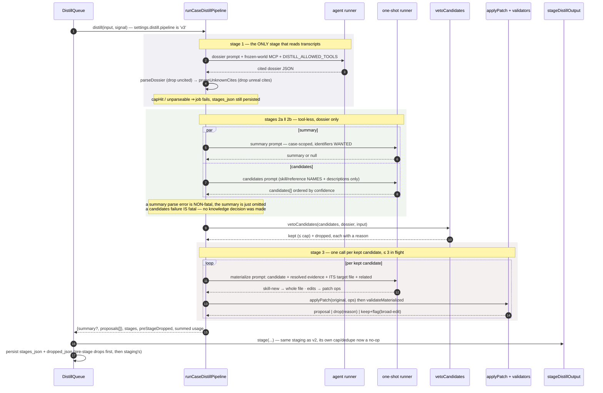
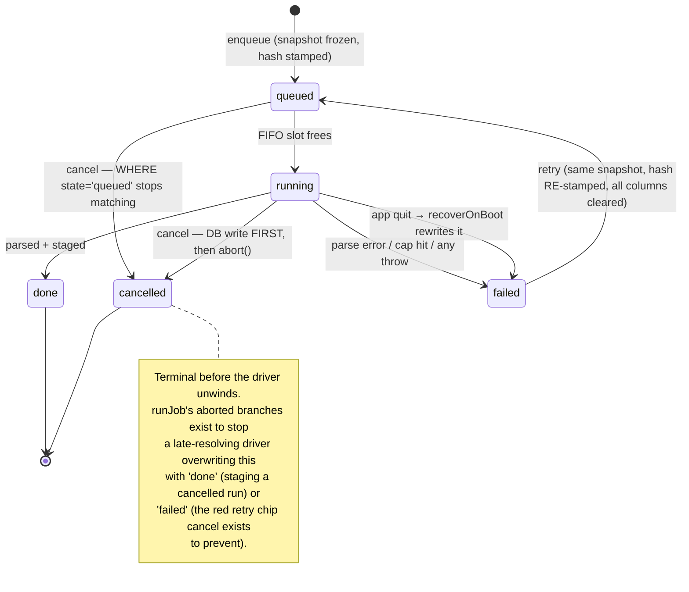

# Distillation

**Distillation** is the step where a case stops being a case and becomes something Argus can use
again. When an investigation ends — or when you ask for it mid-flight — a background agent reads
that case's findings, evidence and transcripts, and drafts **proposals**: a new skill, an edit to
an existing skill, a team-knowledge reference, and a case summary that makes the case findable by
symptom later. Nothing it drafts is applied. Every item lands in a review inbox, and a human
accepts, edits-then-accepts, or rejects it with a reason.

Everything else in Argus helps you solve *this* case. Distillation is the only part whose entire
job is the *next* one — and the only part where an unattended model writes into your shared
knowledge library, which is why the whole feature is shaped around a proposal, a gate, and a
record of why a human said no.

- [Part 1 — How it works and where it is useful](#part-1--how-it-works-and-where-it-is-useful)
- [Part 2 — Under the hood](#part-2--under-the-hood)

---

# Part 1 — How it works and where it is useful

## 1.1 The shape of the feature

| | |
|---|---|
| **Trigger** | Closing a case with **Start distillation** checked, or **Distill** / **Re-distill** in the case menu (works on an open case too). |
| **Runs** | In the background, one job at a time, globally. Nothing blocks; a chip in the top bar shows it running. |
| **Reads** | The case snapshot frozen at enqueue: findings + review states + roles, evidence inventory, session titles, verbatim user turns, the confirmed RCA structure, your installed skills and references, what this case already proposed, and the reject digest. Plus a **frozen transcript world** it can call tools against. |
| **Produces** | Up to N proposals (N by resolution: solved 3, open / wont-fix 2, everything else 1), plus at most one case summary. |
| **Applies** | Nothing. Every item is an inert file in `proposals/` until a human accepts it. |
| **Pipeline** | `v2` (one agentic call, the default) or `v3` (staged: dossier → summary ‖ candidates → materialize). Settings → Background work → **Distillation pipeline**. |

The four output types:

| Type | What it is | Where it lands on accept |
|---|---|---|
| `skill-new` | A symptom-triggered **procedure** nothing installed already claims. Creates a new skill. | `skills-user/<target>/SKILL.md`. |
| `skill-edit` | A procedure that falls *inside* an installed skill's existing `description:`. | The same path — the user tier, which *shadows* a pack skill rather than editing it. |
| `reference-edit` | Durable **facts** consulted while doing something else — schemas, log signatures, thresholds, version splits. Creates the reference if it does not exist. | `references/<target>.md`, stamped `trust_tier: team-knowledge`. |
| `case-summary` | The canonical one-line signature + symptoms / root cause / fix / keywords for this case. | `case_summaries` + FTS, and `summary.md` in the case dir. |

The type is chosen by **how the knowledge will be found again**, not by how big it is. A skill is
advertised by a `description:` written in the words someone would report the symptom in, and a
future agent matches on that description. A reference is a passive index entry you open while
already doing something. So "when *X* happens, do *these steps*" is a skill even when it is short,
and a list of thresholds is a reference even when it is long. That routing rule is the whole point
of the type taxonomy; the older "prefer the smaller change" instinct survives only as a tiebreaker
for when two types genuinely fit the same knowledge.

**Agent memory is not a distillation target.** Memory is the user's personal store — their
preferences, their machine, corrections addressed to the agent. A background pass over a case has
no business writing there, and the contract says so explicitly.



## 1.2 When it runs, and what "one job per case" means

Two paths in:

- **Case close.** The close dialog carries a **Start distillation** checkbox. Its default is
  computed, not always-on: checked when no job ever ran for this case, when the last one failed or
  was cancelled, or when evidence arrived *after* the last successful job's snapshot was taken —
  and unchecked when a job is already queued or running, because that job already covers this
  close. Unchecking it closes the case and distills nothing.
- **The case menu.** **Distill** when the case has never been distilled, **Re-distill** afterwards
  (annotated with what the last run produced — `Re-distill · 3 items`, or `Re-distill · nothing to
  distill`), and **Cancel distillation** while one is in flight. This works on an **open** case,
  which is why the prompt carries `status` and treats an open case differently from a closed one.

There is **at most one queued-or-running job per case**, enforced in the enqueue path rather than
at the call sites. Ask for a second and the first is cancelled: every renderer surface reads the
*newest* job for a case, so if both survived, Cancel would stop the one you can see while the older
one kept running and staged proposals built from a stale snapshot.

The one deliberate exception is **retry**, which refuses instead of cancelling. A retry button on a
stale failure row can outlive the failure by a long time — retrying it while a fresh distill is
already running would silently kill live work with no broadcast the user could connect to their
click. So a stale retry is a harmless no-op and the fresher job survives.

Distillation is **queued, not concurrent**: one job runs at a time across the whole app, in id
order. Closing five cases at once queues five jobs.

## 1.3 What the distiller can see — and why the world is frozen

The snapshot is taken **at enqueue**, and the run reads nothing else. That covers the obvious
inputs (findings with their review states and roles, evidence inventory, session titles, your
skills and references, the confirmed RCA structure if one exists) and one less obvious one: a
**frozen world** of the case's chat transcripts, which the agent reads through tools rather than
receiving inline. The snapshot always carries the skills' and references' **full current bodies**;
what differs is who sees them — v2 inlines every one of them in its single prompt, while v3's
decision stage gets names and descriptions only and the writing stage loads one file: its target.

Freezing it is what makes the eval loop possible. A replay months later calls the same tools
against the same snapshot and gets **byte-identical results** — so when a prompt change scores
better, that is the prompt, not a transcript that grew in the meantime. It also means a
distillation running while you keep working on the case cannot see your new messages: it is
distilling the case as it was when you asked.

Findings are weighted, not flattened: `[accepted]` is confirmed, `[rejected]` is usable only as
"what turned out to be wrong", `[pending]` is unreviewed and cannot carry a causal claim. A finding
whose role is `root-cause` (assigned by a human-confirmed RCA) anchors the summary.

**An empty result is a valid result.** `{}` — no summary, no proposals — is the *expected* answer
for a case closed as duplicate, rejected or not-reproducible, for a forwarded case where nothing
was concluded here, and for an open case where nothing is settled yet. The inbox shows nothing and
the case menu says `Re-distill · nothing to distill`. That is a successful run, not a failure.

## 1.4 The review inbox

Accepted proposals are the only thing that ever writes to your library, and the inbox is where that
happens: a master-detail view with the pending queue on the left (filtered by **Skill** /
**Reference** / **Case summary**, grouped by case) and the proposal on the right, rendered as a
diff — **Unified**, **Split**, or **Proposed** — against the file it would change.

Three actions:

- **Accept** applies the proposal as drafted and archives it.
- **Edit** swaps the diff for a textarea. Accepting from there applies *your* text, and the archive
  records both: the draft the model wrote and the text you actually accepted. That pair is the
  most valuable row in the eval corpus — it is a worked example of what the model should have
  written, so the judge grades a candidate prompt against **your** version, not against the draft.
- **Reject…** opens a reason bar: **Too case-specific** (`overfit`), **Too generic**
  (`overgeneric`), **Wrong**, **Duplicate**, **Other**, plus an optional one-line note — or
  **Skip reason** to reject with none.

Alongside the content, the detail pane carries the context that makes a fast decision safe: the
proposal's **basis** (1–2 lines citing the finding or transcript moment behind it), a `new file` /
`previously reviewed` / `ships with a pack` chip, and — when some *other* case already had the same
target rejected — a banner reading *"Previously rejected as `<tag>` (case `<slug>`): `<note>`"*.
Pack-shipped assets are locked: contribute there instead.

## 1.5 Reject reasons, and the two loops they feed

A reject reason is not paperwork. It feeds two mechanisms with different reach:

1. **Per-asset annotations.** The next distillation of *any* case sees a one-line note next to the
   skill or reference in its index: *"a proposed edit here was rejected as overgeneric (case
   `acme-timeout`)"*. Deliberately cross-case — the whole point is to warn the distiller off
   repeating a mistake a *different* case already made against the same asset.
2. **The reject digest.** Every distillation enqueue first asks whether the digest is stale — five
   or more rejects since it was last built. If it is, a separate **rebuild job** is queued *ahead*
   of the case job: it reads the 50 most recent rejects, builds a deterministic stats block (counts
   by tag, counts by type, every reviewer note verbatim) and asks the model to compress that into
   at most eight instruction-shaped bullets. Whatever the file says at run time is folded into the
   prompt under *"Observed proposal failure patterns"*, and it is visible read-only above the inbox
   as **Observed failure patterns**.

The digest is a queue job like any other, and it is deliberately not retried when it fails: the
digest stays stale and the next case enqueue queues a fresh rebuild on its own. A rebuild that
produces no usable bullets writes **nothing** — clobbering a good digest with an empty one would
also advance its reject counter, hiding the failure until five more rejects landed.

## 1.6 The eval loop

Distillation is a prompt, and prompts regress silently. The loop that stops that:



Every job stores the exact prompt version it ran (`prompt_hash`, a digest of the *static* prompt
parts) and the exact inputs (`input_snapshot`). Together they reconstruct what the model saw. The
export bundles, per case, the latest fully-reviewed job — inputs, raw output, per-stage records for
v3, everything the run dropped, and every accept/reject/edit outcome — as one NDJSON file you move
by hand. The harness replays those inputs against your *current* working-tree prompt, skips any
case whose prompt hash did not change, and asks a model to judge each labelled item against the
one it produced before. The operator's manual is `tools/distill-eval/README.md`.

The file contains raw case data and nothing is redacted, because replay needs the real input.
Treat it like the case itself.

## 1.7 Which pipeline should I pick

**v2 is the default and it is the honest recommendation today.** v3 is built, tested and live-
verified, but the default flip was deliberately not made: it is gated on the harness comparison
running both pipelines over the same corpus and v3 winning. Until that has happened, picking v3 is
picking a promising architecture, not a measured improvement.

What v3 buys:

- **Diagnosability.** Each stage's prompt hash, raw output, usage and error are persisted on the
  job, so a bad proposal is attributable: the fact was never in the dossier, or it was in the
  dossier and no candidate was proposed, or a candidate was proposed and a deterministic gate
  dropped it (with the reason), or it materialized and the *content* is the problem. v2 gives you
  one blob and a verdict.
- **Smaller, single-frame prompts.** v2 inlines the full body of every installed skill and every
  reference so an edit can return the whole merged file — the largest section of the prompt,
  re-sent on every turn of the agent loop, and the documented cause of the "just merge it into the
  big skill" bias. In v3 the decision stage sees names and descriptions only, and the writing
  stage loads exactly one file: its target.
- **Deterministic gates.** Target validity, tier, name regex, caps, dedupe, frontmatter, edit
  locality and case-identifier leakage are all decided by code, not asked of the model.
- **Citations end to end.** Every dossier item carries a cite (`finding` / `session:turn` /
  `evidence path`), cites that name nothing real are pruned, and the surviving cites ride onto the
  proposal as `evidence:` frontmatter.

What it costs: **3–6 model calls instead of 1** (dossier, summary and candidates in parallel, then
one per surviving candidate, up to the cap), and correspondingly more money. The live gates make
that concrete: the v2 gate cost **$1.80** on a fixture built to force tool use (4 turns, 3 tool
calls) and **$0.42** on a small one that distilled in a single turn; the v3 gate cost **$2.64**, of
which the dossier stage alone was **$1.46**. Neither figure is a budget — distillation runs once
per case and the design posture is deliberately quality first, cost tuning later — but a v3 run is
roughly half again a v2 run on the same case.

So: stay on v2 unless you are working *on* distillation. Switch to v3 when you need to know **why**
a proposal was wrong — that is the thing v3 can answer and v2 cannot.

Flip it in Settings → Background work → **Distillation pipeline** (*Single call (v2)* /
*Staged pipeline (v3)*), or by hand in `<ARGUS_HOME>/config/settings.json`
(`{ "distill": { "pipeline": "v3" } }`). It is read per job, so it takes effect on the next
distillation with no restart.

## 1.8 Where the value is

### It is the only thing that turns cases into leverage

Argus gets better as case history accumulates — `search_case_history`, the related-cases panel and
the defect corpus all improve with every case that carries real findings. But findings are
case-scoped: nobody re-reads a two-month-old case to remember how a class of failure was diagnosed.
Distillation is the step that lifts the *class* out of the *instance*, into an artifact whose
`description:` a future agent matches on before it starts guessing.

### The gate is what makes it safe to be aggressive

Because nothing is applied, a bad night's output costs you a few rejects, not a corrupted skill
library you have to unpick. That is what lets the prompt keep a **high bar on truth and generality
but stay neutral on type**: once an item passes the evidence tests, a procedure becomes a skill
without apology, rather than being crammed into an existing one to look conservative. The
precision mechanism is the reviewer and the reject loop, not a timid prompt.

### The reject loop is the part people skip

Rejecting with a reason takes one extra click and is the only input the system has about what
"good" means for your team. Skip it and the distiller keeps making the same mistake; use it and the
same mistake becomes a line in the digest that every later run reads. It is also the only way the
eval corpus gets labels at all.

### Where distillation is not worth it

- **Cases with no findings.** The distiller weights findings first and can only cite what is
  written down. A case closed without a single recorded finding gives it transcripts and hope.
- **Duplicates, rejections and not-reproducibles.** The contract says return `{}`. Running it
  anyway is a model call for a guaranteed empty answer — leave the checkbox unchecked.
- **Open cases you expect to keep working.** Distilling mid-flight is genuinely useful when an
  investigation established something durable and stalled on something else. It is a waste when the
  answer is still moving; the prompt will (correctly) refuse to present a hypothesis as a fix.
- **Anything you want written *your* way.** The distiller drafts; if you find yourself editing
  every accept heavily, write the skill yourself and let distillation cover the cases you would
  otherwise never write up at all.

## 1.9 Limits worth knowing

- **One job at a time, globally**, in id order. A queue of closes drains serially.
- **The snapshot is frozen at enqueue.** Evidence or findings added afterwards are invisible to
  that run — redistill to pick them up. (The close dialog's checkbox default already knows this: it
  re-checks itself when evidence arrived after the last successful snapshot.)
- **Only Claude can run the agentic stage.** The `headlessAgent` capability is Claude-only today;
  every other driver declares `false` explicitly. Copilot and Codex can run the tool-less one-shot
  work (reference sync, the reject digest, and v3's stages 2a/2b/3) but not v2's single agentic
  call or v3's dossier; the ACP drivers declare no headless capability at all and cannot be picked
  as the distillation provider. Pin a provider that cannot do agent work and Settings says so in as
  many words — *"Agent-based distillation requires a provider with agent support (currently
  Claude). This provider can only run reference sync."*
- **Caps are per resolution and are hard**: solved 3, open 2, wont-fix 2, everything else 1. The
  case summary is exempt — it is singular by construction. Overflow is dropped from the end
  (lowest confidence) and the drop is recorded on the job.
- **A proposal with a thin `basis` is dropped before the cap is applied**, so an unsupported claim
  does not consume one of the case's few slots.
- **A redistill supersedes**: the previous run's still-pending, job-stamped proposals for that case
  are deleted before the new batch is written. Proposals *you* wrote mid-case (via the
  contribute-back tool) have no job stamp and are never touched.
- **`confluence`-tier references are never edit targets.** They are regenerated from their upstream
  page on every sync, so an edit is either overwritten or silently detaches the file from its
  source. Knowledge that belongs there goes into a new team-knowledge reference instead.
- **Cancelled runs record no cost.** The row goes straight to `cancelled` and whatever the run had
  already spent is not persisted.
- **The inbox does not render v3's stage records or drop list.** They are persisted and exported to
  the eval corpus; reading them today means the NDJSON bundle, not the UI.
- **`input_tokens` undercounts cached input** — a pre-existing driver accounting gap, not specific
  to distillation.

## 1.10 Not implemented yet

- **The v3 default flip.** Gated on the harness comparison (§1.7).
- **Agentic distillation on non-Claude drivers.** Tracked; blocked on those drivers gaining native
  tool registration.
- **`related`-asset discovery.** v3's candidate stage names the assets it thinks it may conflict
  with, and materialize loads those. A conflict with an asset nobody *named* is missed; auto-filling
  `related` from a Library search is the follow-up.
- **Evidence *bodies* in the tool surface.** The distiller sees the evidence inventory (path, type,
  size) but cannot read an artifact's contents — only transcripts.
- **Write-capable scripting.** The scripting tool is read-only by design; bulk proposal writing
  from a script is a deliberate non-feature until read-only usage data exists.
- **Consuming the drop list.** Everything a run produced but never staged is recorded and exported;
  nothing reads it back yet.
- **A cheaper model for the tool-less stages.** v3 runs every stage on the same provider/model.

---

# Part 2 — Under the hood

## 2.1 Module map

Everything lives under `app/src/main/services/distill/`, with `v3/` holding the staged pipeline.
The split that matters: the distillers are **provider-blind** — they own the prompt, the tools and
the parse, and receive a *runner*. Which provider actually executes is resolved elsewhere
(`agent/headless.ts`, `agent/headlessAgent.ts`), because conflating the two is exactly what once
let the active chat session's "auto" model reach the distiller.

| File | Responsibility |
|---|---|
| `caseDistillContract.ts` | The v2 system contract — 18 numbered rules, isolated from prompt assembly so it stays reviewable. |
| `contract.ts` | v2 prompt sections + `buildCaseDistillPrompt` + `parseCaseDistillOutput` / `DistillParseError`. |
| `caseDistiller.ts` | `runCaseDistill` (v1, tool-less) and `runCaseDistillAgent` (v2, agentic); `DistillAgentRunError` carrying run metadata on every failure. |
| `input.ts` | `assembleDistillInput` — the whole snapshot: findings, evidence, sessions, skills/references (full bodies + reject annotations), RCA structure, already-captured, world, user turns, operator guidance. |
| `world.ts` | `buildWorld` — the frozen transcript snapshot, with per-message / per-session / total clamps. |
| `worldTools.ts` | The four tool implementations + `DISTILL_TOOL_DESCRIPTORS` (hashed prompt surface) + `DISTILL_ALLOWED_TOOLS` + iteration/timeout caps. |
| `mcp.ts` | Wraps those functions as an in-process MCP server over the frozen world; hosts `run_tool_script` on the PTC runner. |
| `promptHash.ts` | `caseDistillPromptHash` — sha256 over contract + sorted section headers + tool descriptors + PTC stub version. |
| `queue.ts` | `DistillQueue`: single in-flight FIFO over `distill_jobs`, enqueue/retry/cancel/`recoverOnBoot`, the reject-digest job kind, per-column persistence. |
| `staging.ts` | `stageDistillOutput` — supersede, basis gate, dedupe, resolution cap, prior-reject stamps, summary rendering. |
| `summaries.ts` | `case_summaries` upsert + FTS, and the ranking primitives the related-cases feature reuses. |
| `rejectDigest.ts` | Staleness rule, deterministic stats block, one-shot rebuild, defensive truncation. |
| `evalExport.ts` | `buildEvalBundle` / `exportEvalBundle` — the NDJSON corpus. |
| `v3/dossier.ts` | Stage 1 contract, prompt, cited parser, `pruneUnknownCites`, `resolveDossierPath`. |
| `v3/summary.ts` | Stage 2a contract, prompt, parser (`summary` or `null`). |
| `v3/candidates.ts` | Stage 2b contract, names-only prompt, candidate parser. |
| `v3/veto.ts` | The deterministic gate between 2b and 3 — one reason per drop. |
| `v3/materialize.ts` | Stage 3 contract, one-target prompt, patch-op parser, `materializeToProposal`. |
| `v3/patch.ts` | Heading-anchored, fence-aware patch application. |
| `v3/validators.ts` | Post-materialize deterministic checks: frontmatter, name, identifier leakage, steps-in-reference, edit locality, basis. |
| `v3/pipeline.ts` | The orchestrator: stage records, aggregate usage, parallelism, abort threading, the three exits. |
| `v3/promptHash.ts` | Per-stage hashes and the composed `caseDistillPipelineHash`. |
| `shared/distill.ts`, `shared/distillV3.ts`, `shared/distillEval.ts` | The types main, the renderer and the harness all share. |
| `main/index.ts` (~940–1060) | The only meeting point: runners, provider resolution, queue deps, `onCaseClosed`, IPC. |
| `renderer/.../settings/DistillationSection.tsx` | Provider / model / pipeline / guidance rows. |
| `renderer/.../DistillChip.tsx`, `lib/distillJob.ts` | The in-flight chip (cancel), the failed-state retry, and the case-menu label. |
| `renderer/.../proposals/` | The inbox: queue, detail, diff views, reject bar, digest panel. |
| `tools/distill-eval/` | The replay + judge harness (dev only, never ships). |

## 2.2 Data model

One SQLite table owns the job lifecycle; the *output* is files on disk, deliberately.



Decisions worth naming:

- **Proposals are files, not rows.** They are inert markdown with frontmatter, reviewable in a text
  editor, and the archive keeps the draft *and* the accepted text. That is what makes edited-accept
  a usable gold standard later.
- **`kind` shares one table.** Reject-digest jobs ride in `distill_jobs` under a sentinel slug, so
  they get the same single-in-flight loop, the same cancel and the same boot recovery for free.
  Every read path that must see only a case's own history filters `kind='case'` — `statusFor`,
  `needsDistillRun` through it, and the eval export's `MAX(id)` subselect.
- **`stages_json IS NOT NULL` is how you tell a v3 row apart.** The composed v3 hash is an ordinary
  12-hex digest, indistinguishable in shape from a v2 one.
- **`raw_output` keeps the v2 shape even under v3.** The pipeline synthesizes a
  ` ```json {summary, proposals} ``` ` fence, so every existing reader (the export, the harness's
  parser) still works.
- **`trajectory_json` keeps the FIRST entries, not the last.** When a run goes runaway, what you
  need is what it tried before it got stuck repeating itself.

## 2.3 A v2 run, end to end



The agent's **final** assistant message must contain exactly one ` ```json ` fence; intermediate
turns are working turns and are never parsed. A budget-exhausted run's text is **never** parsed
either — it can be stale mid-run content, so a cap hit is a failure by construction, not a
best-effort salvage. Both failure shapes still persist their usage: a clean run that burned tokens
and got the closing JSON wrong is the *more* common failure, not a corner case.

## 2.4 A v3 run, end to end



Three exits, not two, and the third is the subtle one:

1. a clean run **resolves** with the full output;
2. any failure that ends the run **throws** `DistillAgentRunError`, whose `agentMeta.stages`
   carries every stage that completed *plus* the failing stage's own error — which is why a failed
   v3 row is still diagnosable;
3. an abort that lands in the **gap between two materialize calls** stops the queue and the
   function *resolves* with a partial run — missing proposals with nothing marking them missing.
   That result is discarded by the queue's `aborted` re-check before staging, never by the pipeline
   itself.

Everything after the dossier is wrapped: a throw from a prompt builder, a validator or a helper is
re-thrown as `DistillAgentRunError` so `stages_json` still lands on the failed row. An abort is
rethrown untouched — the queue must read a cancelled run as cancelled, never as a failure.

### The deterministic gates

**Veto** (between candidates and materialize) runs per-candidate checks in table order, then
intra-batch dedupe, then the cap over survivors sorted by confidence:

| Check | Reason |
|---|---|
| `evidence` empty, or a dossier path that does not resolve | `malformed` |
| target fails `ASSET_NAME_RE` | `bad-name` |
| `skill-edit` target is not an installed skill | `unknown-target` |
| `skill-new` target already exists | `target-exists` |
| `reference-edit` target has tier `confluence` | `confluence-tier` |
| `(type, target)` is already captured, or repeats an earlier candidate | `duplicate` |
| `kind: fact` routed to a skill, or `kind: procedure` to a reference | `kind-type-mismatch` |
| beyond the resolution cap | `cap` |

**Validators** (after materialize, before staging) drop or flag:

| Check | Outcome |
|---|---|
| `ASSET_NAME_RE` on the target (re-checked) | drop `bad-name` |
| `basis` shorter than 20 chars | drop `basis` |
| skills: frontmatter parses, `name:` equals the target, `description:` non-empty | drop `frontmatter` |
| case slug or Jira key in the body **or in a skill's `description:`** (case-insensitive, word-bounded) | drop `case-identifiers` |
| a `reference-edit` body with ≥ 3 numbered-step lines | drop `steps-in-reference` |
| an edit touching > 2 hunks, deleting > 20 % of substantive lines, or changing a frontmatter key other than `description` | drop `broad-edit` — or **flag** it when the model deliberately used the `whole_file` escape hatch |

The identifier check covering `description:` is not pedantry: the description is the single string
a future agent matches a skill on, so a ticket key leaking there is at least as damaging as one in
the body. The locality measure is deliberately coarse (changed hunks + deleted-line ratio over
substantive lines, blank lines and `---`/`***` filtered out) — good enough to catch a rewrite, and
its false-positive shape (many tiny genuinely-local edits) is an accepted trade.

**Patch ops** are heading-anchored and fence-aware: only the first exact match of a heading line is
targeted, `#`-prefixed lines inside a code fence can never be a heading nor end a section, and an
unterminated fence in either the target or the op content is rejected outright rather than silently
mangling the file. `append-file` needs no heading and creates a reference that does not exist yet.

## 2.5 The frozen world and its tools

`buildWorld` reads the case's sessions straight out of `messages_fts` — deliberately **not** the
`listSessions()` helper, which *creates* a session when none exist; a snapshot must never mutate the
case it snapshots. Clamping is layered, and every layer keeps the **end** of the conversation
because late messages carry conclusions:

| Budget | Value | Behaviour |
|---|---|---|
| per message | 8 000 chars | head 6 000 + tail 2 000 with `[… N chars omitted]` between; the message is marked `truncated`. |
| per session | 1 000 messages | keeps the last 1 000. |
| per session | 1 MB (true UTF-8 bytes) | drops earliest messages until the suffix fits. |
| total | 8 MB | drops **oldest sessions** first, never below one. |

Every elision is counted and the counts are served back through the tools — `droppedMessages` on
each session, and `note: "… earlier messages elided at snapshot time"` on any read of a session
that lost messages — so the agent is told what it cannot see rather than silently reading a partial
record as if it were whole.

Four tools, exposed through an in-process MCP server whose handlers read that snapshot and nothing
else:

| Tool | Answers |
|---|---|
| `list_sessions` | Sessions with message counts and dropped counts. |
| `read_transcript` | A slice of one session (`offset` / `limit` / optional `roles` filter). |
| `search_transcript` | Case-insensitive substring search across all snapshot transcripts, returning session / index / a ±120-char excerpt. |
| `run_tool_script` | Runs a Node script that calls the first three via `require('./argus_tools')` — whole-case sweeps whose only context cost is stdout. |

The tool **descriptions are hashed prompt surface**. Editing one is a prompt change and must roll
the hash, which is why `DISTILL_TOOL_DESCRIPTORS` is a shipped constant tested against the zod
schemas — the descriptor list and the schemas are two representations of the same tool surface, and
nothing else pins them together.

Budget: `DISTILL_MAX_ITERATIONS = 50` turns, `DISTILL_AGENT_TIMEOUT_MS = 30 min`. Both are named
constants rather than user settings, tuned from the cost columns rather than by hand.

## 2.6 The trust boundary

Three separate mechanisms, and the first one has a trap worth spelling out.

**`allowedTools` means two different things at two seams, and getting them confused is a live
defect this project already shipped once.** The *runner* argument
(`allowedTools: DISTILL_ALLOWED_TOOLS`) is the **`canUseTool` whitelist** the driver consults. The
*SDK-level* `allowedTools` option is pinned to `[]` **inside** the driver, because a bare entry
there auto-approves the tool before `canUseTool` is ever asked — the SDK says so itself
(`CLAUDE_SDK_CAN_USE_TOOL_SHADOWED`), and echoing the whitelist into it made the deny branch dead
code. So `canUseTool` is the single permission decision: it allows exactly the four
`mcp__argus__*` names it was handed and denies everything else with `not available in
distillation`. Passing `[]` at the *runner* seam would deny every world tool instead — the v3
spec's first draft said exactly that, and the unit test would have certified it. Both v2's
`runCaseDistillAgent` and v3's dossier stage pass the real list. The general rule, learned live:
**never list a tool in `allowedTools` if you also want `canUseTool` to see it.**

**The tool surface is closed.** Four `mcp__argus__*` tools, `tools: []` (no built-ins), no
connectors, no file tools, no Bash, and an empty scratch `cwd`. The distiller cannot read your
repository, reach Jira or GitHub, or touch anything outside the snapshot it was handed.

**Programmatic tool calling (`run_tool_script`) is allowlisted and bounded, but it is not an OS
sandbox.** The script runs in a child process (`process.execPath` under `ELECTRON_RUN_AS_NODE`) in
a fresh temp dir, alongside a generated `argus_tools.js` stub. That stub talks to a loopback TCP
server over newline-delimited JSON, authenticated with a per-run random token compared with
`timingSafeEqual`; requests carry no ids, so every round trip is serialized and concurrent callers
in the model's script cannot swap responses. What **is** defended:

| Mechanism | Effect |
|---|---|
| Server-side allowlist | Only `list_sessions` / `read_transcript` / `search_transcript`; anything else — including `run_tool_script` itself, so no recursion — answers `tool "<x>" is not allowed in scripts`. |
| `PTC_DISTILL_MAX_CALLS = 200` | Inner tool-call flooding. |
| `PTC_DISTILL_STDOUT_CAP = 100 000` bytes | Context flooding — 40/60 head/tail split with an explicit omitted-bytes marker *and* honest byte counters on the result, because a textual marker alone gets re-truncated downstream and misread. |
| `PTC_DISTILL_TIMEOUT_MS = 600 000` | SIGKILL on a wedged script. |
| Env allowlist | The child sees `PATH`, the OS/temp/home vars, and its own `ARGUS_PTC_PORT` / `ARGUS_PTC_TOKEN` — nothing else. API keys and every other `ARGUS_*` var are dropped. A broad prefix pass-through is precisely how a sibling project leaked webhook URLs. |
| stdout only | Only stdout (with stderr folded in) returns to the model. |

What is **not** defended: the script's own code. It runs as your user with full filesystem and
network access; the temp `cwd` confines nothing. That is a recorded product decision — trusting the
script body rather than sandboxing it — with OS sandboxing (or gating it the way Bash is gated in
unattended modes) as a tracked follow-up. It is stated in as many words in `agent/risk.ts`, next to
the `LOW/allow` rating that makes it callable without a prompt.

The generated stub is prompt-adjacent surface, because the model reads the errors it produces:
`PTC_STUB_VERSION` is folded into the distill prompt hash, and bumping it rolls the hash exactly as
a contract edit would.

## 2.7 Prompt hashing and the Prompts-page override

Every job stores a `prompt_hash`: a sha256 (first 12 hex) over the **static** prompt parts —
the contract text plus every section header in sorted key order, plus `JSON.stringify` of the tool
descriptors and the PTC stub version. The dynamic case payload is deliberately excluded because it
lives in `input_snapshot`; together the two fully identify what the model saw, since prompt
assembly is deterministic given both.

v3 composes the same idea one level up: each stage gets its own hash (the dossier stage folding in
the tool surface exactly as v2 does), and the job-level hash is the digest of
`['v3', dossier, summary, candidates, materialize]`. The literal `'v3'` is in there so a v3 hash
can never collide with a v2 hash of the same prompts.

It is stamped **at enqueue**, the moment the snapshot freezes, so a later override change cannot
desynchronize hash and snapshot. `retry()` re-stamps it, because the pipeline flag may have flipped
since the original enqueue and a stale hash would misattribute the export.

**The override trap.** Every contract and section header is registered on the dev Prompts page
under `headless.case-distill.*` — v2 as `.contract` and `.section.<key>`, v3 as
`.dossier.*`, `.summary.*`, `.candidates.*`, `.materialize.*`. Both the prompt builders and the
hash functions take the same `resolve(id)`, so **a saved override wins over the source constant,
and the hash reflects the override**. That is correct — the hash must describe what actually ran —
but it means:

- for an id with a saved override, editing the source constant changes nothing — the override still
  wins, and the app's behaviour does not move;
- the eval harness builds its prompts from the **source constants** (plus `--contract`), so a
  corpus exported from an app with an active override never matches on hash: every case re-runs,
  and it re-runs against different text than the baseline actually saw;
- so when measuring a prompt change, measure against the **resolved** prompt — clear the override,
  or land the edit in the source file, before trusting a comparison.

## 2.8 Staging

`stageDistillOutput` turns parsed output into inert proposal files, in a strict order:

1. **Validate every target and `evidence` value first**, before anything destructive. `writeProposal`
   throws on a target failing the name regex, and the model can plausibly emit one — if that throw
   happened inside the write loop it would fire *after* the supersede step had deleted the old
   batch, losing staged knowledge with nothing written to replace it.
2. **Supersede**: delete this case's still-pending **job-stamped** proposals. Narrowed to
   job-stamped on purpose — a mid-case contribute-back item you wrote yourself has no `job:` stamp
   and is never removed by an automated re-run.
3. **Basis gate**: drop anything whose `basis` trims to under 20 chars, *before* the cap, so an
   unsupported claim never consumes a slot.
4. **Dedupe** against existing pending items and within the batch — again before the cap, so a
   duplicate frees its slot for a later distinct proposal instead of evicting it.
5. **Cap** by resolution (`solved` 3, `open`/`wont-fix` 2, everything else 1; unknown resolutions
   fall back to 1). Overflow is recorded in `dropped`.
6. **Stamp**: `job`, `basis` (single-lined, 300 chars), `evidence` (v3's resolved cites),
   `previously_reviewed` when this case already reviewed that target, and
   `prior_reject_case` / `prior_reject_tag` / `prior_reject_note` when *another* case rejected the
   same target — most recent reject wins, ranked by when the reject happened, not when the proposal
   was created. Same-case rejects are excluded from that map: they are already covered by
   `previously_reviewed`, and stamping a case's own reject onto itself is noise, not a warning.
7. **Summary** last, exempt from both the cap and the basis gate — it is singular by construction.

Under v3 the cap and dedupe have already run in veto, so staging's copies are a no-op for pipeline
output. They stay because they still guard v2 and the in-case `write_proposal` tool.

One subtlety in the snapshot that pairs with supersede: **this case's job-stamped pending proposals
are excluded from "already captured"**. Staging is about to delete them, so listing them would tell
the distiller its own about-to-vanish output was already captured — under v3 the veto would drop
every re-proposal as `duplicate` and a redistill would leave the inbox **empty**. Human-authored
pending items survive supersede, so they stay listed and still dedupe.

## 2.9 Accept and reject — where things actually land

Accept applies to the **user tier**, so a proposal against a bundled asset shadows it rather than
editing it:

| Type | Destination | Gates on the way |
|---|---|---|
| `skill-new` / `skill-edit` | `<ARGUS_HOME>/skills-user/<target>/SKILL.md` | `ASSET_NAME_RE` re-checked; `name: <target>` stamped into the frontmatter *before* validation; refuses to create a **new** shadow of a pack/core skill (*"…ships with a pack (or Argus core) and can't be edited here"*); authorship merged from the file on disk; the same `validateSkill` the in-app editor uses, run on the bytes actually written. |
| `reference-edit` | `<ARGUS_HOME>/references/<target>.md`, stamped `trust_tier: team-knowledge` | Refuses a target whose existing tier is not hand-owned (`bundled` / `hivemind` / `confluence`). |
| `case-summary` | `case_summaries` + its FTS index + `summary.md` in the case dir | Needs the `summary_json` frontmatter; upsert is keyed by case slug, so a later accept overwrites. |

Two details the inbox depends on:

- **`locked` is computed before you click.** The same guards run as a read-only predicate so Accept
  is disabled with a reason rather than throwing on submit.
- **Accepting is a move, not a copy.** The pending file is rewritten with `status: accepted` and
  moved to `proposals/archive/`. For an **edited** accept the archive keeps *both*: the agent's
  draft, then a delimiter line, then your text, plus `edited: true`. "Edited" means your text
  actually differs from the draft — a UI that always sends the textarea contents must not earn the
  stamp for a round trip.

Reject archives the same way with `status: rejected`, always stamping `rejected_at` (distinct from
the proposal's creation `date` — recency tie-breaks need to know when the *rejection* happened),
plus `reject_reason` when a tag was chosen (validated against `REJECT_REASON_TAGS`, since IPC
arguments are untyped at runtime) and `reject_note` reduced to its first non-blank line, trimmed to
200 chars.

## 2.10 Cancel, retry, redistill, recovery



- **Cancel writes state first, aborts second**, synchronously, so the row is already correct if the
  app quits moments later. `recoverOnBoot` only rewrites `state='running'` rows, so a cancelled row
  survives untouched. It is idempotent on a resting job — "it finished while the menu was open" is
  an ordinary race, not an error; only an unknown id throws.
- **A driver can resolve after its signal was aborted** (its CLI happened to finish as cancel
  fired). `runJob` re-checks `signal.aborted` before staging and honours the cancellation anyway:
  the user pressed cancel, so nothing from that run reaches the inbox.
- **Retry reuses the original snapshot** and clears every result column — cost, turns, trajectory,
  drops and `stages_json` — because a v3 attempt's stage records surviving onto a retry that the
  settings flag has since routed to v2 would leave a row claiming stages the run never produced.
- **Redistill takes a fresh snapshot** and cancels any other in-flight job for the slug.
- **`recoverOnBoot`** flips every `running` row to `failed('app quit mid-distill')` and resumes the
  loop if anything is still `queued` — a previous process can also have died between a job's INSERT
  and its loop ever running.

## 2.11 Crossing into Electron

`main/index.ts` is the only place the distiller meets the app.

- **Two runners, two resolvers.** `headlessRun` (one-shot, 10-minute timeout) resolves through
  `resolveDistillProvider`; `distillAgentRun` (agentic, 30-minute timeout) resolves through
  `resolveDistillAgentProvider`, which gates on the `headlessAgent` capability instead. They are
  separate functions on purpose: reference sync and the reject digest must keep running one-shot
  even after agentic support widens past Claude. Neither ever consults the active chat instance.
- **The pipeline flag is read per call**, in both the `distill` dep and `promptHash` — reading it
  once at construction would make the setting require a restart.
- **`onCaseClosed` swallows its own errors.** It is called from the case-status write path; an
  enqueue failure must not fail the close.
- **IPC**: `distill:status` (latest case job), `distill:needs-run` (the checkbox default),
  `distill:retry`, `distill:redistill`, `distill:cancel`, and the `distill:changed` broadcast.
  Broadcasts are advisory and `emit()` never throws — job persistence and queue progress must not
  depend on a renderer being alive. `emit()` also filters on `kind`, so a digest row never
  broadcasts under its sentinel slug.

## 2.12 The eval export

`buildEvalBundle` takes the **latest non-cancelled `kind='case'` job per case** and writes one
NDJSON line each. The exclusions encode real reasoning:

- a **cancelled** job is excluded from the `MAX(id)` pool rather than skipped, because it never ran
  the supersede step — so the earlier `done` job's outcome set is still structurally complete and
  must not be shadowed;
- a `done` job with items **still pending review** is skipped (`items pending review`): an unlabelled
  outcome set is not an eval row;
- a `failed` job **with** stored output is included — a parse failure is itself an eval case;
  without output it is skipped.

Each line carries the frozen `inputSnapshot`, the `promptHash`, the `rawOutput`, v3's `stages`, the
job's whole `dropped` list, and every item's outcome with its reject reason, note, basis and —
when the accepter changed the draft — the human's `editedContent`.

The `dropped` list is exported in full, both halves. Without it the corpus cannot tell "the run
never proposed it" from "the run proposed it and a gate ate it", which is precisely the comparison
a replay needs.

## 2.13 Testing notes

- **Main-process tests are DI-first** per repo convention — the queue takes its runners, its
  staging function and its broadcast as deps, so the whole lifecycle (enqueue, cancel-mid-run,
  retry, boot recovery, digest jobs) is testable with fakes and no Electron.
- **Everything deterministic is a pure function with its own unit tests**: `world.ts`'s clamps,
  `worldTools.ts`'s three readers, `veto.ts`'s table (one test per row), `patch.ts`'s ops,
  `validators.ts`'s reasons, both prompt-hash compositions. These are the rules that fail *silently*
  in production, which is exactly why they are not left inside a model call's shadow.
- **The prompt builders are tested for byte stability**, including the omit-when-absent discipline:
  a section with no content is omitted entirely rather than rendered as `(none)`, so a snapshot
  that predates a field produces the same prompt bytes it always did.
- **`mcpSchemaConformance.test.ts`** pins the tool descriptors against the zod schemas — the one
  place two representations of the prompt-facing tool surface could drift.
- **Two integration suites** drive the whole path over fake runners: `distill.integration.test.ts`
  (v2) and `distill.v3.integration.test.ts` (snapshot → dossier → 2a‖2b → veto → materialize →
  staging → inbox, per-stage persistence, aggregate cost, cancel mid-stage-3, 2a failure non-fatal,
  2b failure fatal).
- **Live CDP gates** are the only thing that proves the real SDK path.
  `app/scripts/cdp-distill-v2.mjs` (port 9247) and `app/scripts/cdp-distill-v3.mjs` (port 9248)
  drive the actual app over the DevTools protocol against a seeded fixture whose decisive values
  live **only in assistant turns**, so a run that does not use the tools cannot pass. Both start
  with an **identity gate** — the connected app must actually show the fixture case, or they exit
  rather than certifying another branch's app; the v3 gate adds a **pipeline gate** (the app must
  report `distill.pipeline=v3`) so a misconfigured run refuses to spend instead of proving nothing.
  Two anti-vacuity details worth copying: the v3 gate re-derives the expected per-stage hashes by
  bundling and importing the app's *own* `promptHash.ts` rather than re-implementing the digest,
  and it reads `evidence:` off the proposal file on disk, because that field is not on the IPC
  record and an IPC-based check would pass for the wrong reason. Recorded results: v2 $1.80 on the
  tool-forcing fixture (4 turns, 3 tool calls) and $0.42 on a small one; v3 28/28 at $2.64 (dossier
  $1.46), 5 turns / 4 tool calls, per-stage hashes matching, `evidence:` present.
- **The harness is not covered by CI** — the workflow only runs from `app/`. Run
  `tools/distill-eval`'s tests by hand when you touch it.
