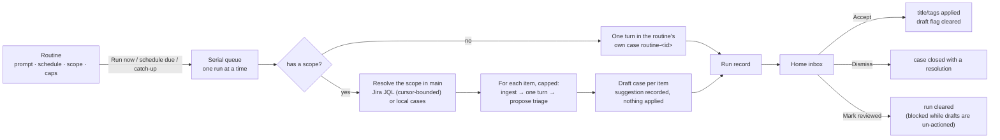
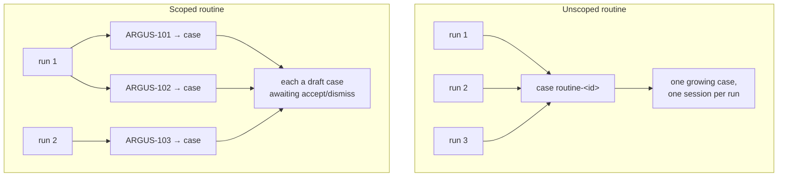
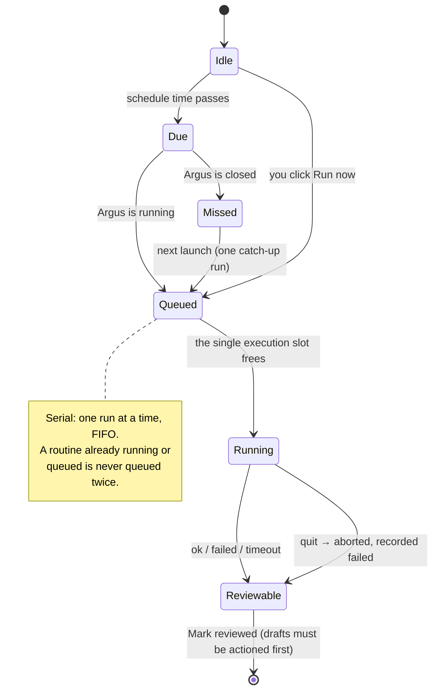
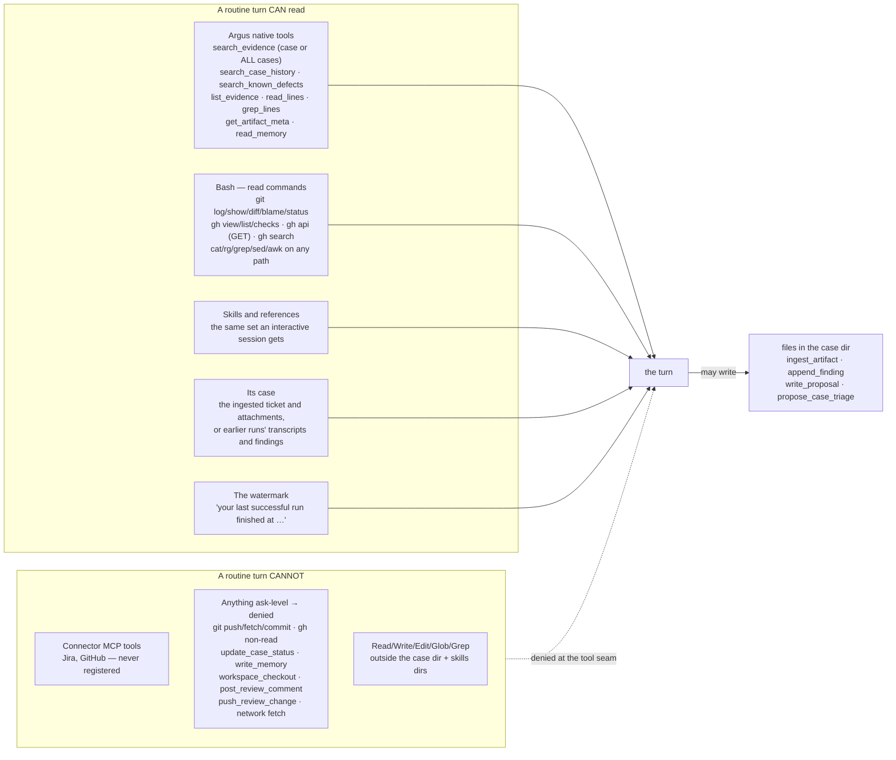
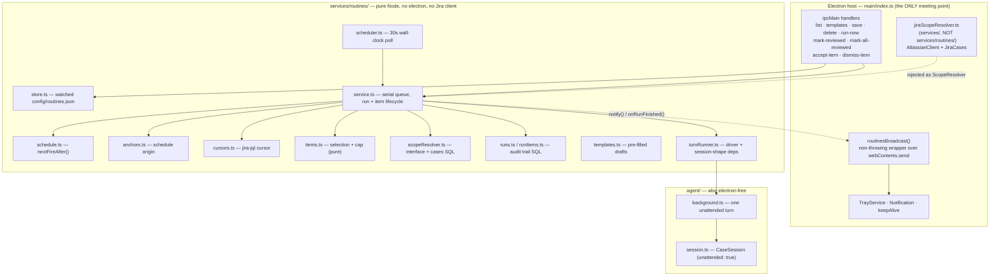
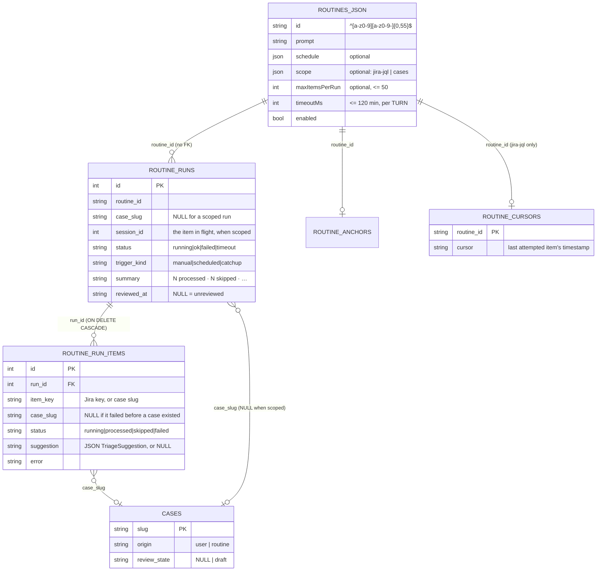
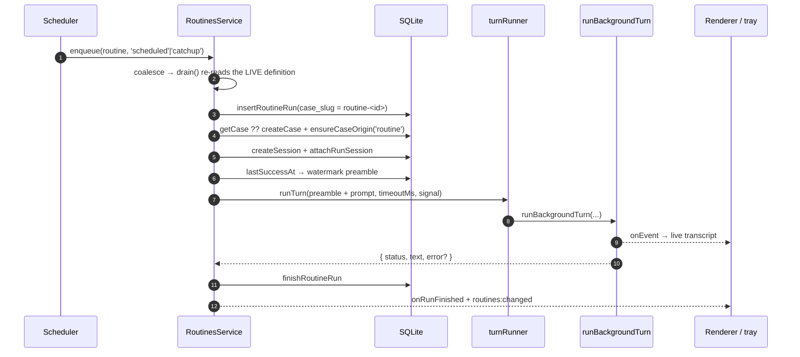
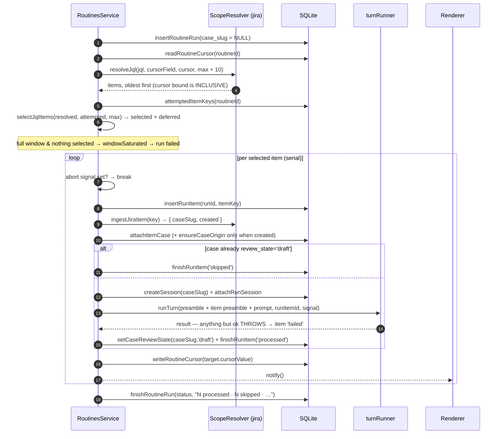
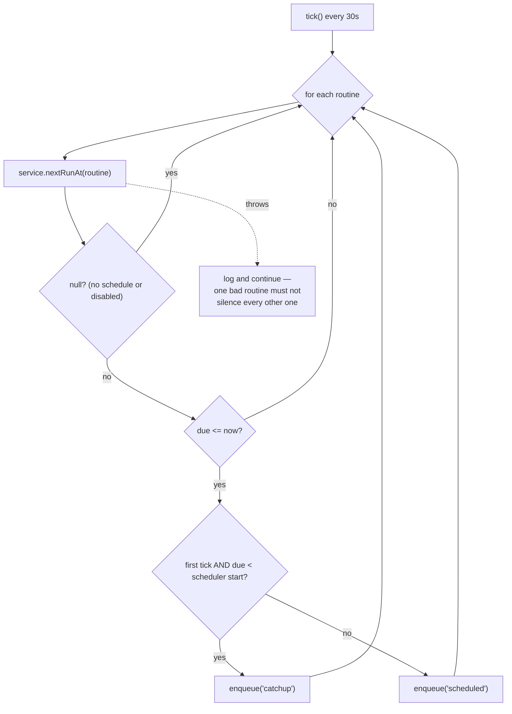
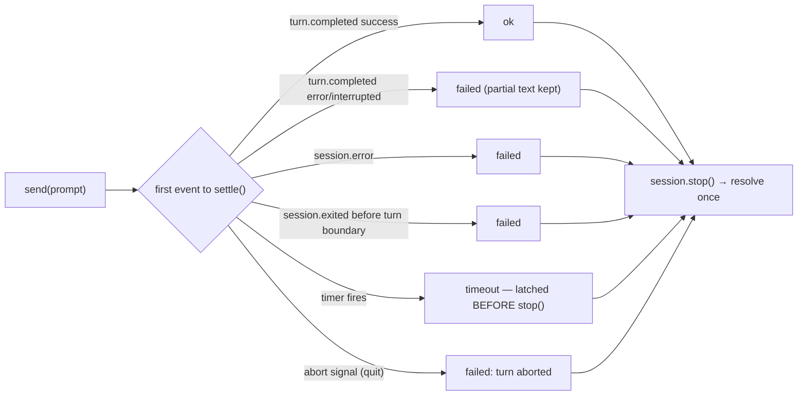

# Routines

A **routine** is a saved prompt that Argus runs *unattended* — on demand, or on a schedule — and
reports back into an inbox you read afterwards. A routine can run as a single turn, or as a **loop
over items** resolved from a Jira query or from your own cases, producing one **draft case** per item
that you accept or dismiss.

Everything else in Argus assumes a human is watching a session. Routines are the opposite: work that
happens while nobody is present, and whose value is only realised if there is a trustworthy record of
what happened afterwards — and a review step before anything it suggests is applied.

- [Part 1 — How it works and where it is useful](#part-1--how-it-works-and-where-it-is-useful)
- [Part 2 — Under the hood](#part-2--under-the-hood)

---

# Part 1 — How it works and where it is useful

## 1.1 The shape of the feature

| Field | What it means |
|---|---|
| Name | Free text. The id (`nightly-pre-triage`) is derived from it and is fixed once created. |
| Prompt | What the unattended session is asked to do. No user is present to answer questions. |
| Schedule | `Manual only`, `Every N minutes`, `Daily at HH:MM`, or `Weekly on <days> at HH:MM`. Local time. |
| **Scope** | Optional. Absent = one turn against the routine's own case. Present = a loop, one turn per item. Two kinds: `jira-jql` and `cases`. |
| **Items per run** | Only meaningful with a scope. Default 10, hard cap 50. The remainder carries to the next run. |
| Timeout | Wall-clock limit **per turn**, 1–120 minutes. With a scope that is per *item*, not per run. |
| Model / driver | Optional. Absent means the driver default (`claude-agent-sdk`). |
| Enabled | A disabled routine stays saved but refuses to run and never fires. |

Routines are managed in **Settings → Routines** (including **New from template**), and they report on
**Home**, above the case grid.



## 1.2 Where the work lands

This depends entirely on whether the routine has a scope, and the two shapes are genuinely different.

**Without a scope** (the simple shape): every run writes into **one case of its own**, named
`routine-<id>`. The first run creates it; every later run adds another session to the same case. It
is a permanent, growing workbench — open it and you get the full transcript of every run, tool call
by tool call.

**With a scope**: the routine has **no case of its own at all**. Each *item* gets a case — a Jira
ticket is fetched into one (created, or adopted if you already opened that ticket by hand), and a
`cases`-scoped item already *is* a case. Each item gets its own session, and the run row points at no
case; the per-item rows do.



Cases a routine created are tagged **Routine** in the case grid; a case awaiting review carries a
**Draft** badge — including a case the routine *adopted* rather than created, because the badge tracks
review state, not authorship.

You can open any of these cases *while a run is in progress* and watch it stream live, exactly like an
interactive session. Argus blocks you from typing into it until the run ends (see
[1.8](#18-what-a-routine-is-and-is-not-allowed-to-do)).

### When does a routine create a case, and when should you?

A routine creates cases **only through a scope**. There is no case-creating tool in the agent's tool
set — the turn itself can never spin one up. The engine creates:

- the `routine-<id>` workbench, once, for an unscoped routine; or
- one case per item, for a scoped one — and for a `jira-jql` scope it **adopts** an existing case when
  the ticket already has one, so a ticket you opened by hand is worked in place rather than duplicated.

So the decisions left to you are:

- **Give a routine a scope** when the work is *per thing* and each thing deserves its own case,
  evidence and review — tickets, stale cases. You get one draft per item and can accept some and
  dismiss others.
- **Leave it unscoped** when the output is one report about many things — a digest, a health check, a
  cross-case summary. One case, one growing logbook, nothing to accept.
- **Create a new *routine*** rather than growing one prompt, when: the watermark should be separate
  (it is per routine), the cadence or timeout differs, you want to pause one job without the other,
  or you want them reviewed as separate inbox rows. A run's outcome is atomic — if half a bundled
  prompt fails, the whole run is `failed` and the watermark does not advance for the half that worked.
- **Create a case by hand** when *you* start an investigation. A routine's job is to hand you a draft
  with enough context to decide, not to decide.

**If an unscoped routine's case grows unwieldy, delete it.** The next run recreates it empty
(get-or-create). The run history survives — `routine_runs` has no foreign key to `cases` — though the
transcripts those rows point at go with the case.

## 1.3 The inbox — the part that matters

Finished runs land on **Home**, above the case grid. A scoped run expands into one row per item:

```
Routine runs · 2 to review                            [Mark all reviewed]
┌────────────────────────────────────────────────────────────────────────────┐
│ ok  scheduled  Pre-triage · 02:41                                          │
│                7 processed · 1 skipped · 12 carried to the next run         │
│                                                        [Mark reviewed]     │
│   processed  ARGUS-4021   "Login retry storm after token refresh"          │
│                           severity:high · component:auth                   │
│                           [Open case] [Accept] [Dismiss ▾]                 │
│   processed  ARGUS-4022   …                                                │
│   skipped    ARGUS-4019   already has an un-actioned draft                 │
│   failed     ARGUS-4020   timed out after 900000ms                         │
└────────────────────────────────────────────────────────────────────────────┘
```

- **Accept** applies the suggested title and tags to the case and clears the draft flag.
- **Dismiss** closes the case with a resolution you pick. The draft flag deliberately stays set, so a
  dismissed draft stays distinguishable from a case that was never one.
- **Mark reviewed** clears the run from the inbox — and **refuses while that run still has
  un-actioned drafts**, with a message saying how many. That is not fussiness: marking a run reviewed
  removes the only place its drafts can be acted on, and those cases would keep a permanent Draft
  badge with a suggestion nobody can ever apply. **Mark all reviewed** is all-or-nothing for the same
  reason.

The section is **absent entirely** when there is nothing to review. Full history, including reviewed
runs, always stays in **Settings → Routines → Recent runs**.

| Run status | Meaning |
|---|---|
| `running` | In flight. Not in the inbox — nothing to review yet. |
| `ok` | Finished on its own terms. For a scoped run, at least one item processed (or nothing was due). |
| `failed` | The turn errored; or every item failed; or the run was cut short by quit; or the Jira cursor is stuck. |
| `timeout` | The turn hit the per-turn wall-clock limit. |

| Item status | Meaning |
|---|---|
| `processed` | Its turn completed and the case is now a draft awaiting your review. |
| `skipped` | The case already had an un-actioned draft, so a second one would be noise. Still counts as attempted. |
| `failed` | Ingest failed, or the turn did not come back clean. The error is on the row. |

A run also carries a **trigger**: `manual`, `scheduled`, or `catchup` (a fire the app was closed for).

## 1.4 Schedules, and what "nightly at 02:00" means on a desktop app

Argus is a desktop app, not a server, so a schedule can only fire while the process is alive:

1. **While Argus is open** — the routine fires within 30 seconds of its due time.
2. **When Argus was closed at fire time** — it runs **once** at the next launch, labelled `catch-up`.
   A week-long shutdown produces one run, not seven.
3. **Keep Argus running** — a setting (`General`) that makes closing the last window hide to the tray
   instead of quitting. The Routines editor offers it the moment you pick a non-manual schedule. On
   macOS it is unconditional and the editor says so instead of offering a button.

With keep-alive on, the tray is the app's whole surface: **Open Argus**, **N runs to review**, **Quit
Argus**. The first time a close does not close, Argus notifies you once so it does not read as a bug.

When a run finishes and no window is visible, you get a desktop notification with the first line of
the summary; clicking it opens Argus on the inbox.

**Quitting interrupts a live run.** The queue is cleared and the turn in flight is aborted, and that
run is recorded `failed` — keeping whatever item counts it had already earned, plus "stopped: the app
was quitting". It is never recorded `ok`, because `ok` would advance the watermark past work that
never happened.



## 1.5 What a routine can actually see

Two different actors fetch things, and keeping them apart is what makes the rest make sense.

**The host (main process) resolves the scope, before any turn starts.** This is the one place Argus
reaches an external system with your credentials while nobody is present. It runs your JQL, and for
each selected ticket it fetches the issue and its attachments into a case. The interface it does that
through has no write method at all — resolving a scope cannot modify Jira.

**The agent turn then works on what is already local.** It has no Jira access and needs none: the
ticket is sitting in its case as evidence. Its input surface is:



Three consequences worth internalising:

- **Live Jira reaches a routine through the scope, not through the agent.** A `jira-jql` routine sees
  fresh tickets every night because the *host* fetched them. An unscoped routine sees only what is
  already in Argus.
- **The repository is reachable through Bash, not through the file tools.** A background session is
  constructed with *no workspace roots*, so `Read`/`Grep`/`Glob` outside the case directory and the
  skills directories are hard-denied. Bash is classified per command: `git -C <repo> log`,
  `gh pr list -R owner/repo` and `rg <pattern> <abs-path>` all classify as low-risk reads and run.
  Repo- and CI-shaped routines work; they go through the CLIs.
- **`search_known_defects` works in routine runs.** The external defect corpus is wired into
  background sessions, so dup-checking against past Jira tickets is real. (It was silently inert
  before increment 5 — if you have an older note saying so, it is out of date.)

## 1.6 Where the value is

### Intake, not automation for its own sake

Argus's expensive step has always been the first hour on a ticket: pull it in, fetch the attachments,
read them, work out whether it is a duplicate, guess a severity and a component. That work is
mechanical, high-volume, and needs no human judgement *until the end*. A scoped routine does all of it
overnight and hands you the judgement call alone.

The design detail that makes this trustworthy rather than alarming is that a routine **cannot apply
anything**. It proposes; you accept. So the failure mode of a bad night is noise in the inbox — not
corrupted case metadata you have to unpick afterwards.

### It feeds the flywheel

Argus gets better as case history accumulates: `search_case_history`, distillation, and the defect
corpus all improve with every case that carries real findings. Manual triage skips that step — people
close tickets without writing down why. A routine cannot skip it, because writing the finding is in
the prompt. Every ticket a routine pre-triages leaves behind a case with citations, which makes the
*next* dup-check better.

### Routines revisit; humans do not

The `cases` scope has no cursor, deliberately, so a sweep re-selects a case whenever it changes. Nobody
re-reads a case that has been quiet for two weeks, and that is exactly where things rot. This is the
one capability with no manual equivalent — the others are things you *could* do by hand and would
rather not.

### Where routines are not worth it

- **Anything needing a write back to Jira or GitHub.** Structurally impossible, by design.
- **Anything you would want to steer mid-flight.** There is no cancel and every approval is denied.
- **Deep multi-step investigation.** One turn per item, and a 10-item run at a 15-minute timeout can
  occupy 2.5 hours of the single serial slot.
- **Repo-wide code analysis.** It works only through `git`/`gh`/`rg` in Bash and is genuinely better as
  an interactive session.
- **High-volume intake.** Serial execution, a 50-item ceiling, and a minute-wide cursor bucket all
  argue against pointing a routine at a firehose.

### If you are starting from scratch

Take the pre-triage template, give it a **narrow** JQL and `maxItemsPerRun: 3`, and run it manually a
few times before you schedule it. That is cheap to evaluate, and it avoids the one awkward failure mode
that remains — a frozen cursor, which is far likelier with a wide query and a small cap.

## 1.7 Where routines are useful — worked examples

### Dup-gate on incoming bugs

```
Scope:    jira-jql — project = ARGUS AND type = Bug AND created >= -7d ORDER BY created ASC
Items:    5 per run
Schedule: Daily at 03:00
Timeout:  5 minutes per item
Prompt:   Decide one thing only: has this defect been seen before?
          Run search_known_defects on the clearest symptom, then again on any stack trace or error
          signature in the attachments. Then run search_case_history on the same terms.
          Record what you found with append_finding, citing [relPath:line].
          Finish with propose_case_triage and exactly one tag: dup:<TICKET-KEY> if you found a
          convincing match, or dup:none if you did not. Do not propose a title.
```

The cheapest routine that changes your day. It is narrow, fast, and the one question it answers is the
one that decides whether a ticket deserves any time at all.

### Evidence pre-loader

```
Scope:    jira-jql — project = ARGUS AND type = Bug ORDER BY created ASC
Items:    10 per run
Schedule: Daily at 01:00
Timeout:  10 minutes per item
Prompt:   Do not triage. Read this ticket and every attachment, then write ONE orientation finding:
          what the reporter says happened, which artifacts are attached and what each contains,
          and the single most promising place to start. Cite [relPath:line] throughout.
```

No triage claims at all — the value is pure latency-hiding. Attachment fetch and archive extraction are
slow, and you never wait for them again. Pairs well with the dup-gate above as a separate routine, so
the two have independent watermarks and either can be paused alone.

### Pre-triage new tickets (ships as a template)

```
Scope:    jira-jql — project = ARGUS AND type = Bug ORDER BY created ASC   (cursor: created)
Items:    10 per run
Schedule: Daily at 02:00
Timeout:  15 minutes per item
Prompt:   You are pre-triaging one defect ticket. Its evidence is already in this case.
          1. Read the ticket and attachments with list_evidence and search_evidence.
          2. Run search_known_defects on the clearest symptom, then on any stack trace or error
             signature. Say plainly whether this is a duplicate and of what.
          3. Record what you concluded with append_finding, citing [relPath:line].
          4. Finish with propose_case_triage: a tighter title, and tags for severity
             (severity:high|medium|low) and component (component:<area>).
          Propose, do not decide.
```

This is the routine the whole feature was designed around, and it is the strongest case for it. You
arrive to ten cases that are already fetched, already read, already dup-checked, each with a proposed
title and tags and a finding explaining why. Your morning is *accept, accept, dismiss as duplicate,
accept* — minutes instead of an hour, and every judgement is auditable before it lands. Use **New from
template** and fill in the JQL, which ships empty on purpose.

### Stale-case sweep

```
Scope:    cases — status: open, untouched for 14 days
Items:    15 per run
Schedule: Weekly, Fri at 16:00
Prompt:   This case has had no activity for two weeks. Read its findings and recent transcript and
          say in one line what it is waiting on and what the next concrete step is. If it looks
          abandoned, propose the tag stale:abandoned; if it is blocked on someone, propose
          blocked:<who or what>. Do not change the case yourself.
```

A `cases` scope has **no cursor** — deliberately, because a sweep must be able to revisit. An item is
selected when the routine has never looked at it, or when the case changed since the last look. So a
case you touch after a sweep comes back around; one you leave alone does not consume a slot every week.

### Escalation watch

```
Scope:    jira-jql — priority in (Blocker, Critical) AND status != Done ORDER BY updated ASC
          (cursor: updated)
Items:    5 per run
Schedule: Every 60 minutes
Prompt:   Read this ticket and any prior case history for the same component. Summarise what
          changed, whether we have seen this failure mode before, and propose severity and
          component tags.
```

`cursorField: updated` is what makes this a *watch* rather than an intake: a ticket that gets a new
comment re-enters the window. Note the interaction with the draft rule — a ticket whose draft you have
not actioned is skipped, so the inbox cannot fill with repeats of the same ticket.

### Post-release burst (manual)

```
Scope:    jira-jql — fixVersion = "2.0.11" AND created >= -3d ORDER BY created ASC
Items:    25 per run
Schedule: Manual only
Timeout:  10 minutes per item
Prompt:   Triage this post-release report. Say whether it plausibly relates to what shipped in this
          version, dup-check it against the corpus, and propose severity and component tags.
```

A scoped routine does not have to be scheduled. Run this once when a release lands, walk away, and come
back to a reviewed queue. The item cap is doing real work here — this is the one shape where you *want*
a big batch, and the run reports what carried over so you know whether to run it again.

### Morning digest of what moved (unscoped)

```
Scope:    none
Schedule: Weekly, Mon–Fri at 07:00
Timeout:  15 minutes
Prompt:   Using the local git and gh CLIs, summarise what changed in <repo path> since your last
          successful run: merged PRs, new failing checks, and anything touching the areas the open
          cases are about. Three bullets maximum.
```

One report, no items, nothing to accept — so leave it unscoped. Name the repo path in the prompt; a
routine has no linked-workspace context of its own.

### Recurring health probe (unscoped)

```
Scope:    none
Schedule: Every 30 minutes
Timeout:  5 minutes
Prompt:   Run `gh run list -R <owner/repo> --branch main --limit 10`. If anything is red, name the
          workflow and the first failing step from its logs. Otherwise reply with a single line.
```

### The common thread

Routines pay off when **all** of these hold:

- The work is repeatable and expressible as one prompt — per item, or per report.
- No question needs answering mid-flight. A routine that must ask something has already failed.
- The output is *reviewable*: a draft, a suggestion, a summary you can act on — never a change
  already applied.
- It is worth doing when you are not there.

For the cases where none of that holds, see
[Where routines are not worth it](#where-routines-are-not-worth-it) above.

## 1.8 What a routine is, and is not, allowed to do

The trust boundary is structural, not a line in the prompt. Three separate mechanisms:

- **Reads yes, outward writes no.** The turn registers no Jira or GitHub MCP tools at all, and every
  ask-level verdict becomes a deny — which is what stops `git push`, `git commit`, `gh pr create` and
  non-GET `gh api` while leaving the read commands alone. The scope resolver reaches Jira, but its
  interface has no write method.
- **Propose, never apply.** A routine turn cannot change a case's title, tags or status. It calls
  `propose_case_triage`, which *records* a suggestion against the item row and answers "recorded as a
  suggestion — it is NOT applied; a human accepts or dismisses it". The tool exists only in a session
  that is processing an item, and refuses outside one. Accept is the only thing that writes to a case.
- **File writes are confined to the case directory.** With no workspace roots, `Write`/`Edit` outside
  the case dir is denied outright, and the skills directories are read-only.

Alongside that:

- **It has your skills and your privacy settings** — the same Argus skills an interactive session
  gets, the same memory-topic switches, the same tool-risk overrides. It deliberately does *not*
  inherit the interactive persona; its identity comes from an unattended preamble.
- **It knows when it last succeeded** ("concentrate on what has changed since then"). The watermark
  advances on success only.
- **You cannot talk to a run in flight.** The case is openable and streams live, but the composer
  refuses messages until the run ends.

## 1.9 Limits worth knowing

- **Runs are serial** — one routine at a time, globally, and within a scoped run one item at a time.
  A second request joins a FIFO queue; a routine already running or queued is never queued twice.
- **There is no cancel.** Once a run starts, the per-turn timeout is what ends it (or quitting the
  app). This is why the timeout is capped at 120 minutes, `interval` schedules have a 5-minute floor,
  and items per run are capped at 50 — every item buys another turn of up to the timeout.
- **A queued routine is re-checked at start**, so disabling or deleting it while it waits is honoured.
- **Items that do not fit the cap carry over**, and the run says how many. For a `jira-jql` scope that
  carry-over number is a floor, not the true remainder — it only counts the rows the query window
  over-fetched.
- **A stuck Jira cursor is reported, not silent.** If a whole query window comes back full of tickets
  the routine has already attempted, the cursor can never advance on its own, so the run is recorded
  `failed` with an actionable message (widen items per run, narrow the JQL, or recreate the routine to
  clear its cursor). This shape used to be indistinguishable from a quiet night.
- **A case with an un-actioned draft is skipped**, so an ignored backlog cannot consume every future
  run's cap.
- **A failed item still advances the cursor.** Deliberate: holding it would make one permanently-bad
  ticket the first item of every future run forever, with nothing behind it ever reached.
- **A crash mid-run** leaves the run recorded `failed` ("Interrupted: the app exited or crashed while
  this run was in progress"), reconciled at the next launch, along with any item rows it stranded.
- **Deleting a routine** removes the definition and drops its schedule anchor and Jira cursor. Run
  history stays; the cases it created are left alone.
- **Editing `config/routines.json` by hand works** — the file is watched. A file that will not parse
  leaves the app on zero routines with a banner, and saving from the UI replaces the broken file.
- **The editor has no scope-kind picker.** A scope arrives from a template or from hand-editing the
  JSON; the editor then shows a JQL field and an items-per-run field for it, and round-trips a `cases`
  scope untouched.

## 1.10 Not implemented yet

- **A `repo` scope.** It has no defined item unit — commits, files and directories are all defensible
  readings — so it was left out rather than guessed at.
- **Paging past a saturated Jira window.** The over-fetch covers every case anyone has described;
  beyond that the run fails loudly instead of paging.
- **Cancelling a run** from the UI (quitting the app is the only interrupt), **token accounting**,
  **per-routine external-write opt-in**, and a **headless server host** (the engine is built so one is
  possible; nothing hosts it yet).

---

# Part 2 — Under the hood

## 2.1 The governing design rule: no Electron in the engine

Every module under `app/src/main/services/routines/` — plus `agent/background.ts` — imports **no
`electron`**, and now also no Atlassian client. Everything window-shaped, and everything that talks to
an external system, enters through injected callbacks bound in one place: `app/src/main/index.ts`.

The reason is a future headless host. It also has an immediate payoff: the engine is testable without
a runtime, which is why `turnRunner.ts` and `jiraScopeResolver.ts` exist as separate modules at all —
both used to be inline closures in `index.ts`, which no test can load.



| File | Responsibility |
|---|---|
| `shared/routines.ts` | Zod schemas (schedule, **scope**), payload types, `TriageSuggestion`, template types. |
| `routines/store.ts` | Watched `JsonFileStore` over `config/routines.json`. |
| `routines/service.ts` | Serial queue; the unscoped path, the **item loop**, accept/dismiss, `payload()`. |
| `routines/scheduler.ts` | Wall-clock poll that decides what is due. |
| `routines/schedule.ts` | `nextFireAfter(schedule, after)` — pure local-time arithmetic. |
| `routines/anchors.ts` | Persisted schedule origin for a routine that has never run. |
| `routines/cursors.ts` | Persisted `jira-jql` cursor; refuses to store a blank one. |
| `routines/items.ts` | **Pure** selection: which items run, which carry over. No db, no clock. |
| `routines/scopeResolver.ts` | The `ScopeResolver` interface (the trust boundary) + the local `cases` SQL. |
| `routines/runs.ts` / `runItems.ts` | Run and item audit trails, startup reconciliation, inbox predicates. |
| `routines/templates.ts` | `ROUTINE_TEMPLATES` — data, never written to disk unasked. |
| `routines/turnRunner.ts` | Driver resolution + session-shape deps; the testable seam. |
| `services/jiraScopeResolver.ts` | The Jira half: JQL windowing and ticket→case ingest. Outside the engine on purpose. |
| `agent/background.ts` | One windowless turn, the trust boundary, and the abort seam. |
| `renderer/.../settings/RoutinesPage.tsx` | Definitions, templates, Run now, full run history. |
| `renderer/.../routines/RoutineInbox.tsx`, `RunItemRows.tsx` | Home inbox and per-item accept/dismiss. |

## 2.2 Data model

Definitions live in a **file**; runs, items, cursors and anchors live in **SQLite**. Definitions are
user-editable configuration; the rest is an audit trail and lifecycle state.



Notable decisions:

- **`routine_runs.case_slug` is nullable, and NULL is meaningful** — a scoped run opens no case of its
  own, so writing the slug anyway made the inbox's "Open case" button lead to a 404.
- **`routine_runs` has no FK to `cases`**; `routine_run_items` cascades from its run.
- **`cases.review_state` is nullable** — `null` is a normal case, `'draft'` awaits review. Dismiss
  leaves it set on purpose, so a dismissed draft stays distinguishable from a case that never was one.
- **`reviewed_at` is a nullable timestamp**, answering both "is it in the inbox" and "when was it
  cleared".
- **Timestamps are ISO-8601 UTC**, so `MAX(started_at)` over text is chronological.

## 2.3 One run, end to end

### The unscoped path



### The scoped path



Two rules in that loop are worth stating on their own:

- **The cursor advances over *attempted* items — including failed and skipped ones — and never over
  capped ones.** This is a deliberate deviation from the parent spec's "advance only for items
  actually processed". Capping and failing are different: a capped item was never looked at, a failed
  one was. Holding the cursor on a failure makes one permanently-bad ticket the first item of every
  future run, forever, while the run still reports success on everything else.
- **The cursor is written per item, inside the loop but outside the per-item catch.** Outside, because
  it tracks attempts; inside, because a run capped at 10 of 40 must resume at item 11 and a crash at
  item 7 must not replay items 1–6.

### The serial queue

`RoutinesService` holds `running`, a FIFO `queue`, `current: Promise<void>`, and a `runningAbort:
AbortController` mirroring the run in flight.

- `enqueue` **coalesces by routine** and is **silent** when it does. Throwing "already running" (as
  increment 1 did) is unusable by a scheduler: three routines at 02:00 would leave two starved daily.
- `drain` sets `running` **synchronously** before the detached execution suspends.
- `drain` re-resolves the routine **from the store at start time**, so disabling or deleting a queued
  routine is honoured.
- `stopForQuit()` clears the queue and aborts `runningAbort`, which is threaded into every `runTurn`
  call — including each item's turn — so quit reaches whichever turn is live.

### No run is ever left `running` — structurally

The run row is opened **first**, and everything after it lives inside a try/catch that still closes the
row. Across processes, `reconcileInterruptedRuns` (and its item-level counterpart) runs once at boot,
**before any IPC handler is registered**, so the `status='running'` predicate can only match rows a
previous process left behind.

## 2.4 Scheduling: a poll, not a timer

`RoutineScheduler` polls every 30 seconds and asks one question per routine: *is the next fire in the
past?*



A `setTimeout` armed for the exact instant breaks three ways that all happen on a laptop — suspend, a
DST shift, a clock change — each needing its own detection and re-arm, plus teardown on every edit of
`routines.json`. A poll has one path and self-heals from all of them, at the price of up to one tick
of lateness.

It also makes **catch-up the same code as ordinary firing**, and because `nextRunAt` computes *one*
next fire rather than enumerating missed occurrences, a week-long shutdown produces one run.

`start()` runs its first tick **synchronously**, which is why the wiring order in `index.ts` is
load-bearing: reconciliation, then the IPC handlers, then `scheduler.start()`, then the tray.

### Two kinds of persisted "where was I"

| | `routine_anchors` | `routine_cursors` |
|---|---|---|
| Answers | when does this routine's *schedule* start counting from | where does the next *query* start |
| Applies to | any scheduled routine with no runs yet | `jira-jql` scopes only |
| Write semantics | `INSERT OR IGNORE` — fixed on first sight, forever | UPSERT — its whole job is to move |
| Dropped when | the routine is deleted | the routine is deleted |

Both are persisted for the same reason: an in-memory version is re-derived at every launch, and both
failure directions are silent. For the anchor: measuring from process start makes a freshly saved
routine already overdue once uptime exceeds its period, and makes a long-interval routine recede
forever without ever firing. For the cursor: replaying everything already processed, or skipping
everything that arrived while the app was closed.

`nextRunAt` anchors on the routine's **last attempt** (any outcome). Anchoring on success would leave
a failing routine's anchor unmoved, so it would retry every 30 seconds, unattended, until someone
noticed. `lastSuccessAt` — a different query — is the *watermark* handed to the prompt, and that one
is successes only.

`writeRoutineCursor` **refuses a blank value, loudly**. Every consumer reads a stored cursor with a
truthiness test, so `''` does not mean "no cursor yet" — it silently means "start from the beginning",
where everything is already attempted and the routine stalls at zero items per run while every run
still reports `ok`. A Jira issue with a missing `fields` block produces exactly that value; the
resolver already drops such issues, and this throw is the second, independent gate.

### `nextFireAfter` — strictly after, and local

Pure arithmetic, no I/O. **Strictly after `after`** is the load-bearing contract: a schedule that could
return `after` itself would be due again the instant it fired. `daily`/`weekly` walk forward one local
calendar day at a time over eight candidates, reading `getDay()` off the *constructed* date so a DST
normalisation across midnight is still filtered against the day it landed on. All arithmetic is local:
on spring-forward a `02:30` daily normalises to 03:30; on fall-back it fires once at the first 02:30.

## 2.5 Item selection is pure

`items.ts` has no database, no network and no clock — callers hand in what they already read. Both
rules it owns fail silently in production if they are wrong, which is exactly why they are unit-testable
in isolation.

**`selectJqlItems(resolved, attempted, maxItems)`** filters already-attempted keys **before** the cap,
so a window full of seen keys still does a full run's worth of new work. The exclusion is by key
because the query bound is inclusive (`>=`): Jira timestamps are not unique, and a strict `>` would
drop one of two tickets sharing a minute — permanently and silently. Inclusive means the last item of
the previous run always comes back, and only its key identifies it.

That is also why the query over-fetches by `CURSOR_BOUNDARY_SLACK = 10`. Asking for exactly
`maxItemsPerRun` would spend slots on keys the filter then removes; at `maxItemsPerRun: 1` it would
**starve outright**. Two honest caveats live on that constant:

- The reported carry-over is a **floor, not the true remainder** — it counts only over-fetched rows
  that survived the cap. At `max: 2` against 100 matching tickets it tops out at 10 while 98 remain.
- "The boundary" is a whole **minute-wide bucket**, because the cursor is formatted at JQL's own
  minute resolution. More than ten tickets filed in the same minute can still stall a routine. Paging
  is the complete fix and is deliberately not built.

**`selectCaseItems(candidates, maxItems)`** has **no cursor**, and that is a design statement rather
than an omission: a monotonic cursor would visit each case once and never again — the opposite of a
sweep. The predicate is `lastAttemptAt === null || updatedAt > lastAttemptAt`, strictly greater so a
case looked at in the same instant it was modified is not re-selected forever. The last-look join is
scoped to the routine, because leaking another routine's newer look would make this one skip a case it
has never seen.

`resolveCaseCandidates` excludes draft cases in SQL — a draft is not a candidate, it is output this
routine already produced. Tag matching happens in JS, not SQL, because `tags` is a JSON array in a TEXT
column and a `LIKE` would match `severity:high` inside `severity:highest`.

## 2.6 The unattended turn

`runBackgroundTurn` runs one turn in a windowless `CaseSession`. The trust boundary is structural:

| Mechanism | Effect |
|---|---|
| `unattended: true` | Every ask-level verdict denies at **both** seams, and `AskUserQuestion` auto-dismisses. Also what makes the turn unable to hang — a pending approval with no renderer would block forever. |
| **No `extraMcpServers`** | Omitting the field entirely keeps connector tools from ever being registered. |
| **No `permissionMode`** | `bypassPermissions`/`acceptEdits` let some drivers skip both seams; `session.ts` downgrades them under `unattended`, and this never sets one at all. |
| `signal` | An external interrupt, separate from `timeoutMs`. Quit aborts it; an already-aborted signal settles synchronously rather than arming a timer. |
| `runItemId` | Present only on a scoped item's turn. It is what advertises and gates `propose_case_triage`. |

**Resolution model — one latch, one teardown, one resolve.** `outcome` is write-once; the first caller
of `settle()` decides the result and is the only one that triggers teardown. Every later event —
including the `session.exited` that `stop()` itself emits — sees the latch and is ignored, so the
timeout path cannot be overwritten by its own teardown.



### Where the input surface comes from

`workspaceRoots: []` is what makes the file tools case-local: `inSandbox` is
`caseDir ∪ workspaceRoots ∪ readonlyRoots`, so an `fs-read`/`fs-write` call resolving outside the case
directory or the skills directories is a hard **deny**.

Bash is classified on a different axis. Only `cd` to an absolute path outside the sandbox and recursive
`rm` are policed by path; otherwise it dispatches on the program:

| Command shape | Verdict | Under `unattended` |
|---|---|---|
| `git log/show/diff/blame/status/grep/rev-parse/ls-files/remote/branch/describe/shortlog` | allow, LOW | runs |
| `git push` | ask, HIGH | denied |
| `git fetch/pull/switch/checkout/stash/worktree/reset/restore/clean` | ask, MEDIUM | denied |
| unrecognised `git` subcommand | ask, MEDIUM | denied (fails closed) |
| `gh … view/list/diff/status/checks`, `gh search …`, `gh api` (GET), `gh auth status` | allow, LOW | runs |
| `gh api -X POST/PUT/PATCH/DELETE`, any other `gh` group | ask, HIGH | denied |
| `grep`/`rg`/`cat`/`awk`/`sed`/`head`/`tail` on an `evidence/` path | ask, MEDIUM | denied — use the pack CLIs |
| anything else | allow, LOW | runs, cwd = the case dir |

Native Argus tools split the same way. Readers (`search_evidence`, `search_case_history`,
`search_known_defects`, `list_evidence`, `read_lines`, `grep_lines`, `get_artifact_meta`,
`read_memory`), the local writes (`ingest_artifact`, `append_finding`, `write_proposal`) and
`propose_case_triage` are `allow`/LOW. `update_case_status`, `write_memory`, `workspace_checkout`,
`post_review_comment` and `push_review_change` are ask-level, therefore unavailable.

### What `turnRunner` binds

- **Driver-kind mismatch is fatal.** `getDriverByKind` falls back to Claude for any unregistered kind,
  and `driverKind` is already on the session row by then — a typo'd `"coplilot"` would record and
  display one provider while executing on another. Throwing routes it through the run's try/catch as a
  `failed` run whose error the UI renders.
- **Skills yes, persona no.** `assembleMode` is called for its skill half only (`enabledSkills` plus
  `skillIndex`, which is how the model learns those skills exist). A persona for helping a human triage
  is not a persona for unattended automation.
- **Live sources, not defaults.** `agentAccess` is required rather than optional — defaulting it would
  re-enable every memory topic the user disabled. `defectCorpus` is passed here too, which is what
  makes `search_known_defects` work in a routine at all.

### `propose_case_triage`

The suggestion half of the feature hangs on one thread: `runItemId`. The tool is advertised only to a
session constructed with it, and refuses without one even then — answering plainly that this session is
not processing an item, rather than silently dropping a judgement the model believes it recorded. The
suggestion (`title?`, `tags?`, `rationale`) is stored on the item row as JSON and applied by nothing but
`acceptItem`.

`title` and `tags` are the whole surface because they are the whole of what a case has — there is no
severity, component or owner column, so those are expressed as tags (`severity:high`, `component:auth`).

## 2.7 Accept, dismiss, and the review gate

`acceptItem` is **ordered, not transactional**, and the order is the guarantee: apply the suggestion
first (`setCaseTriage` writes the row *and* mirrors `case.json`, so no SQL transaction could cover both
halves), then clear the draft flag. A failure leaves the case still a draft, still in the inbox, still
acceptable — whereas the reverse would drop a case out of review with the suggestion never applied. It
reads the item's current state rather than trusting the renderer, so a second window that already
accepted re-applies the same values instead of different ones. Clearing the flag is unconditional: an
item whose turn proposed nothing is still a draft a human has now read.

`dismissItem` closes the case with a resolution and **leaves `review_state` set**, with an
already-closed guard so a second window's dismissal is a no-op rather than a second close with a
different resolution.

The **review gate** lives in SQL next to the inbox predicate:

```sql
-- unreviewed
status != 'running' AND reviewed_at IS NULL
-- un-actioned drafts on a run
(SELECT COUNT(*) FROM routine_run_items i JOIN cases c ON c.slug = i.case_slug
  WHERE i.run_id = routine_runs.id AND c.review_state = 'draft' AND c.status != 'closed')
```

`markRunReviewed` **throws** when that count is non-zero rather than silently declining, so the renderer
surfaces it like any other rejected mutation; `markAllRunsReviewed` checks across every unreviewed run
and is all-or-nothing, throwing *before* writing anything. The reason is not tidiness: the inbox renders
items only while their run is unreviewed, so marking a run reviewed removes the only surface where its
drafts can be acted on — and a `cases` scope skips drafts, so nothing would ever pick them up again.

## 2.8 Crossing into Electron

`index.ts` is the only place the engine meets Electron, through injected callbacks and IPC.

**Both callbacks must be non-throwing, and that is load-bearing rather than defensive.**
`webContents.send` on a window destroyed mid-iteration raises "Object has been destroyed", and each call
site turns that into a different, worse failure:

| Where a throw would land | Consequence |
|---|---|
| `notify()` right after `insertRoutineRun` | Outside the try/catch that records the outcome — the row stays `running` for the session: the one state the service exists to make impossible. |
| `notify()` after `attachRunSession` | Inside it — a good routine recorded `failed` because a window closed. |
| `notify()` in `drain`'s `.finally()` | Skips the `drain()` continuation and stalls the **entire** pending queue. |
| `onEvent` | First statement of `runBackgroundTurn`'s `emit`, ahead of the switch that decides the outcome — a throw skips `settle()` entirely and the turn only ends at its timeout. |

### IPC surface

| Channel | Direction | Notes |
|---|---|---|
| `routines:list` | invoke | The whole `RoutinesPayload`, including `runItems`. |
| `routines:templates` | invoke | Static data; read once, never written to disk by main. |
| `routines:save` / `delete` | invoke | `unknown` on purpose — the store zod-validates. Delete also drops the anchor **and the cursor**. |
| `routines:run-now` | invoke | Throws on unknown/disabled; a busy engine queues instead. |
| `routines:mark-reviewed` / `mark-all-reviewed` | invoke | Throw when un-actioned drafts remain. |
| `routines:accept-item` / `dismiss-item` | invoke | Both return the refreshed payload. |
| `routines:changed` | broadcast | **Payload-free** — every listener re-reads, so a double announce is harmless and a missed one still converges. |
| `routines:focus-inbox` / `consume-focus-inbox` | broadcast / invoke | Push when a window exists; consume-once pull when one was just created. |

Every mutation both **returns** the payload and **broadcasts**: the caller gets its answer synchronously
with the click, and every *other* window converges on the broadcast. A renderer store refreshed only by
its own invoke reply is a multi-window bug this product has already shipped twice.

**The focus-inbox race is inverted, not deferred.** A broadcast sent right after `showMainWindow()`
creates a window lands in a `webContents` that has only just started loading. Deferring to
`did-finish-load` trades one race for another, since React does not guarantee the subscribing effect has
flushed. Instead main sets a `pendingFocusInbox` flag and the renderer *asks* on mount.

### `payload()` — one read, everything the UI needs

```ts
{ routines, loadError, runningId, queued, nextRunAt, runs, unreviewedCount, runItems }
```

`runs` is capped at 50; `unreviewedCount` is a real SQL `COUNT`, because a derived count would
under-report precisely when the backlog is large enough to matter. `runItems` is **flat**, not nested —
the renderer groups by `runId`, and one shape serialises over IPC. `nextRunAt` is guarded per routine,
so one broken schedule cannot take the whole payload down.

## 2.9 Session safety: two writers on one row

A routine's transcript streams into the normal case UI, so its case is openable and its session
selectable **while the run is in flight**. Without a guard, a message typed there would reach
`AgentService.send`, which finds no map entry for the background session and builds a **second**
`CaseSession` on the same `sessionId` — without `unattended`, with connectors composed, resuming from
the same cursor. Two drivers would write the same mirror and the same `turns`/`tool_calls` rows, and
the routine's `stop()` would tear the user's live chat down under them.

`runningRoutineForSession(db, sessionId)` is the guard, injected into `AgentService` as a predicate. It
reads the **run table** rather than asking the service, so it answers correctly from anywhere holding
the db.

## 2.10 Store semantics

`RoutineStore` wraps a watched `JsonFileStore` over `config/routines.json`:

- **Parse failure keeps the app on in-memory defaults plus a `loadError`**, and an explicit save
  replaces the broken file. The file is parsed as **one document**, so a single schema-busting entry
  reverts everything to defaults rather than partially loading.
- **Write before adopt.** If the write throws, nothing changed, so store, file and memory still agree.
- The watcher means hand edits reach the UI, and the store's own `subscribe` fans out to
  `routines:changed` alongside the service's `notify`.

The editor layers form fields **on top of the stored routine** rather than rebuilding from form state:
`routineSchema` is a `looseObject`, so `routines.json` can carry keys the editor knows nothing about
(and today `scope` is largely one of them — there is no scope-kind picker). Optional fields are assigned
*or deleted*, never conditionally spread; a spread only adds keys, so a Model the user emptied would be
resurrected and never clearable.

Templates are **data, not a seeding side effect**. Nothing is written until the user saves — that file is
hand-editable and fs-watched, so writing unasked would churn it, re-fire the watcher, race the user's
edits, and need an "already seeded" marker to avoid resurrecting a template they deleted. The pre-triage
template ships with an **empty JQL on purpose**, and the schema's refusal to parse it is the property the
editor's save guard relies on.

## 2.11 Tray and process lifetime

`shouldKeepAlive({ platform, keepAlive })` is its own function because both ways of getting it wrong are
silent: return `true` wrongly and the user has an invisible process; return `false` wrongly and the
engine dies with the window while the toggle claims it is on. macOS is unconditional — the app already
never quit on last-window-close there.

`TrayService` owns no routines state: `unreviewedCount` is a callback read fresh on every rebuild, and
Electron menus are immutable once built, so a rebuild is the only way a count change reaches the menu.

On quit the order matters: `stopForQuit()` (clear the queue, abort the live turn), destroy the tray (an
undestroyed `Tray` keeps the process alive after quit on Windows), stop the scheduler *before* closing
the store, then close the store's watcher. Quit does **not** block on the run's teardown — that would
hang for up to the turn timeout — and does not write the run row itself: the startup backstop reconciles
anything stranded before the first IPC handler is registered, so no renderer can observe it.

## 2.12 Testing notes

- The engine is DI-first per repo convention: main-process tests never `vi.mock('electron')`, which the
  electron-free rule makes structural rather than conventional. The Jira half is injected as a
  `ScopeResolver`, so the item loop is testable with no Atlassian client at all.
- `items.ts` is pure by design — the cap and the cursor boundary are the two rules that fail silently in
  production, and they are unit-testable with plain arrays.
- `whenIdle()` exists **for tests** (and any future host that needs to drain the queue). Its loop is
  required, not defensive: `drain` replaces `current` from inside the previous run's `.finally()`.
- `RoutineScheduler.tick()` is public so tests drive it directly instead of through fake timers.
- Scheduling is unit-tested with a fake clock including both DST transitions; there is a live
  exit-check covering the item loop, accept/dismiss and the corpus gates.
- The tray is invisible to jsdom, so live verification of that part is mandatory; everything cheaply
  checkable is covered by unit tests so it is not paid for in manual passes on two platforms.
