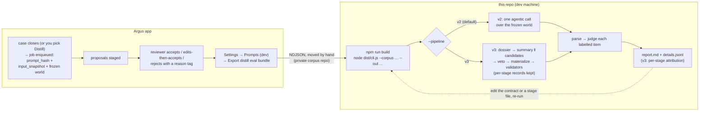

# @argus/distill-eval

Replay + judge harness for the case-distill prompt. Dev tool; never ships in the app.

This is the guide for the whole feedback loop: how rejects get labeled in the app, how a
corpus gets exported, how to run the harness against a prompt change, and how to read the
result. The design is `argus-docs/superpowers/specs/2026-07-29-distill-feedback-loop-design.md`;
this file is the day-to-day operator's manual. For what distillation itself does — the two
pipelines, the frozen world, the staging gates — see `docs/distillation.md`.

## Why this exists

Case-close distillation (`app/src/main/services/distill/`) turns a case into skill / reference /
case-summary proposals. Sometimes it gets it wrong in one of two opposite directions —
**overfit** (too tied to this one case to reuse) or **overgeneric** (too vague to act on) —
and sometimes it's just **wrong** or a **duplicate**. Tuning the prompt to fix one failure
mode without causing the other requires three things this harness provides:

1. a labeled corpus of runs that went wrong (and right, as controls),
2. a way to rerun a candidate prompt over exactly those same inputs, and
3. a way to judge whether the candidate is actually better — not regressed elsewhere.

## The loop, end to end



Nothing is uploaded automatically. The export writes one file to a location you pick; you
commit it by hand to a private evals corpus repo when you're ready to work on the prompt.

## Step 1 — label rejects in the app

Every proposal reject (the Proposals view) opens a small reason bar. Five tags, shown under
friendlier labels — `overfit` ("Too case-specific"), `overgeneric` ("Too generic"), `wrong`
("Wrong"), `duplicate` ("Duplicate"), `other` ("Other") — plus an optional one-line note, or
**Skip reason** to reject with none. This is shown for **every** reject, not just distiller-produced
proposals — but only rejects on proposals stamped with a `job:` id (i.e. produced by a
distill job, not a mid-case contribute-back) end up in the replay corpus, because only those
have a deterministic input to replay against.

The tags are defined in `app/src/shared/proposals.ts` (`REJECT_REASON_TAGS`) — that's the
single source of truth for what labels exist; the harness's judge prompt
(`src/judge.ts`) has special-cased phrasing for `overfit`/`overgeneric` since they're
opposite failure directions, and generic phrasing for the rest.

There's no separate "flag this whole distillation as bad" action. If a job produced one bad
item among several good ones, reject just that item — labels live at the item level.

## Step 2 — export a corpus bundle

Settings → **Prompts** → **Distill eval export** section → "Export distill eval bundle". The
Prompts page only appears in the Settings nav when Dev Tools is enabled (`payload.devTools`,
gated in `app/src/renderer/src/components/settings/settingsPages.ts`'s `visiblePages`) — with
it off the page is unreachable even via a hand-typed deep link, not just hidden from the nav.
This calls `exportEvalBundle` (`app/src/main/services/distill/evalExport.ts`), which:

- takes the **latest non-cancelled job per case** (`MAX(id) ... GROUP BY case_slug`) — an
  earlier job's proposals may have been superseded (deleted, un-archived) by a re-distill,
  so only the latest job's outcome set is structurally complete;
- includes it only if that job is `done` with **every** staged item reviewed (none still
  pending — skipped jobs are counted and named in the export result, e.g. "3 skipped: job 7
  (acme-timeout) — items pending review"), or `failed` with a stored `raw_output` (a parse
  failure is itself an eval case — a good candidate prompt should produce fewer of these);
- writes one NDJSON line per included job to the file you choose in the save dialog (default name
  `distill-eval-YYYY-MM-DD.ndjson`). Each line is a `DistillEvalBundleLine`
  (`app/src/shared/distillEval.ts`): the job's frozen `inputSnapshot`, its `promptHash`, its
  `rawOutput`, and every proposal outcome joined in from the archive (`accepted` / `rejected` +
  `rejectReason` + `rejectNote` + `basis`, and `editedContent` when the accepter changed the
  draft). A v3 job also carries `job.stages` (the per-stage records from `stages_json`), and any
  job carries `job.dropped` — everything the run produced but never staged, v3's veto/validator
  drops ahead of staging's own `cap`/`basis` drops.

The button reports back inline: `N jobs → <path>`, plus ` · N skipped` when any were.

**The file contains raw case data** — findings, evidence descriptions, chat titles, full
skill/reference bodies. Nothing is redacted; replay requires the real input. Treat it like
you'd treat the case itself: private evals repo or local checkout only, never a public repo,
never pasted into a ticket.

## Step 3 — run the harness

```bash
cd tools/distill-eval
npm install
npm run build
node dist/cli.js --corpus <path-to-corpus.ndjson> --out <path-to-results-dir>
```

Flags (`src/cli.ts`):

| flag | required | meaning |
|---|---|---|
| `--corpus <file>` | yes | the NDJSON bundle from Step 2 |
| `--out <dir>` | yes | where `report.md` and `details.jsonl` get written |
| `--pipeline <v2\|v3>` | no | which distiller to replay with; default `v2`. Anything else exits 2 (see below) |
| `--contract <file>` | no | replace the distill contract prompt with this file's contents when replaying (v2 only — rejected with `--pipeline v3`, see below) |
| `--model <id>` | no | model id passed to `claude -p --model <id>` |
| `--limit <n>` | no | only replay the first n corpus lines (fast iteration on a subset). Must parse as a finite number |

Parsing is deliberately minimal: each flag takes the **next** argv element, so `--pipeline=v3` does
not parse and there are no subcommands. Bad or missing arguments print the usage line and exit `2`;
anything thrown during the run exits `1`.

By default (`--contract` omitted) the harness replays with the **repo's current
working-tree prompt** — `CASE_DISTILL_CONTRACT` / `CASE_DISTILL_SECTIONS` in
`app/src/main/services/distill/contract.ts` — so the normal workflow is: edit the contract
in your working tree, run the harness, read the report, iterate. `--contract` exists for
comparing an alternate draft without committing it, e.g. A/B-ing two candidate rewrites.

### `--pipeline v3` — replay through the staged pipeline

`--pipeline v2` (the default) replays each line through the v2 distiller: one agentic call that
must produce the whole `CaseDistillOutput`. `--pipeline v3` replays the **staged** pipeline
instead (`app/src/main/services/distill/v3/pipeline.ts`): dossier (agentic, tools over the frozen
world) → summary ‖ candidates (tool-less) → veto → materialize per candidate (tool-less, ≤3 at a
time) → validators. Same corpus, same frozen inputs, same judge; only the distiller under test
changes.

What that costs and buys:

- **Runner mapping** (`src/replayV3.ts`). Stage 1 uses the `agent` runner — the pipeline builds
  its own MCP server from `inputSnapshot.world` and hands it over, but the harness **ignores it**
  and lets `claudeAgentRunner` build `createReplayMcpServer(world)` from the *same* frozen world,
  because that is the one that stubs the PTC tool the harness cannot host. Stages 2a/2b/3 use the
  `oneShot` runner — the same one the judge uses. No usage/turn/tool numbers are reported into the
  stage records: the harness does not measure them, and zeros would read as measured zeros.
- **Skip-if-unchanged** compares against `caseDistillPipelineHash()` (the hash of the four stage
  hashes, with `'v3'` folded in) instead of `caseDistillPromptHash()`, so a v2 corpus line never
  counts as reused under `--pipeline v3` and vice versa. A reused row runs nothing, so both its
  `stages` and its pre-stage drops come from the corpus line itself (`job.stages` and
  `job.dropped`, exported from the job's `stages_json` / `dropped_json` columns) — stage
  attribution reads the same on a reused case as on a re-run one, instead of reporting "dropped
  nothing" for a run that in fact dropped items.
- **Cap handling is lossier than the app's.** The harness's agent runner reports only the SDK's
  terminal subtype and has no `capHit` channel, so any non-success subtype is passed into the
  pipeline as `capHit: 'iterations'`. The behaviour that matters survives — a cut-off run's text
  is never parsed, the case is `budget-exhausted`, and the report still labels a non
  `error_max_turns` subtype an agent error rather than a budget cap.
- **`--contract` is rejected with `--pipeline v3`.** That flag overrides the single v2 contract id;
  v3 has four stage contracts with different ids, and the resolver throws on ids it doesn't know.
  To try a v3 prompt change, edit the stage file (`v3/dossier.ts`, `v3/candidates.ts`, …) in your
  working tree and re-run — the same edit-and-rerun loop as the default v2 path.
- **Per-stage attribution in the report** — see Step 4.

**Runners**: there are two, passed around together as `EvalRunners` (`src/replay.ts`):

| runner | type | used for |
|---|---|---|
| `agent` (`src/agentRunner.ts`, `claudeAgentRunner`) | `(prompt, world) => Promise<AgentReplayResult>` | the distill replay itself — agentic, tools over the frozen world |
| `oneShot` (`src/runner.ts`, `claudeRunner`) | `(prompt) => Promise<string>` | the judge — one prompt in, one verdict out, no tools — and, under `--pipeline v3`, stages 2a/2b/3 |

`claudeRunner` shells out to `claude -p --output-format text` (adding `--model` if passed),
piping the prompt over stdin — not argv and not `execFile` (whose default `maxBuffer` silently
truncates at 1MB; these prompts carry full skill/reference bodies so that limit is a real risk,
not a theoretical one).

`claudeAgentRunner` drives the Claude Agent SDK's `query()` headless with an **in-process MCP
server** (`createReplayMcpServer`) serving `list_sessions` / `read_transcript` /
`search_transcript` out of the exported `inputSnapshot.world` through the *same*
`app/src/main/services/distill/worldTools.ts` functions the live run used — same snapshot in,
same tool answers out. Its SDK options deliberately mirror the app's `runClaudeHeadlessAgent`:
`maxTurns: DISTILL_MAX_ITERATIONS`, `tools: []` (no built-ins), **`allowedTools: []`** with
`canUseTool` as the single permission decision (it allows exactly `DISTILL_ALLOWED_TOOLS` and
denies everything else with `not available in distillation replay`), an empty scratch `cwd`, and
`env: claudeSpawnEnv()` — which is what turns Claude Code's **own** auto-memory off. That last one
is a fidelity requirement, not hygiene: auto-memory also *reads*, so leaving it on would splice
unrelated `~/.claude` memories into the replay, grading the candidate contract on an input the live
job never saw.

The empty `allowedTools` is not an oversight either: a live run on 2026-08-17 showed the SDK warn
`CLAUDE_SDK_CAN_USE_TOOL_SHADOWED` — a bare `allowedTools` entry auto-approves the tool *before*
`canUseTool` runs, which made the deny branch dead code. Both the app and this runner now pin it to
`[]`. Never list a tool in `allowedTools` if you also want `canUseTool` to see it.

Two deliberate differences from the app's loop: the harness passes `maxTurns:
DISTILL_MAX_ITERATIONS` (50) where the app passes `maxIterations + 1` (51), because the app spends
that extra turn on a budget-exhausted **nudge** ("return your final json now") that the harness
does not send — its prompt is a plain string, not a pushable queue. A replay therefore has one
fewer turn of headroom than the live run, and a candidate contract that loops near the cap is
likelier to be cut off here than in the app.

If you need a different backend, implement `AgentRunner` / `OneShotRunner` and wire it in where
`cli.ts` builds the runner bag.

**Budget-exhausted replays are not graded.** If the SDK ends a run with a non-success subtype
(`error_max_turns`, `error_during_execution`, `error_max_budget_usd`, …), that subtype rides out of
the runner as `capSubtype`, the case is classified `budget-exhausted` (never `ok`), its items are
skipped, and `report.md` names it. Rationale: the app *fails* a capped distill job rather than
parsing its text, so grading that text here would score a candidate on output the product would
have thrown away.

**Agent replay: the two things it does not reproduce**

1. **`run_tool_script` (PTC) is stubbed.** The tool stays *registered* — its description is
   hashed prompt surface, so removing it would change the prompt being evaluated — but every
   call answers `REPLAY_PTC_UNAVAILABLE`, telling the agent to sweep with the direct tools
   instead. Real script execution needs the Electron-side PTC service
   (`app/src/main/services/ptc/run.ts`), which the harness cannot host. A replay of a job that
   used scripts therefore *approximates* its trajectory; since the judge grades final items and
   never trajectories, that is an accepted approximation, not a silent one.
2. **Pre-v2 corpus lines have no world → degraded replay.** Lines exported before the agentic
   distiller carry no `inputSnapshot.world`. They still replay (their `promptHash` never matches
   a v2 hash, so they always re-run), with all four tools registered and every world tool
   answering the distinguished error `transcripts unavailable for this replay (pre-v2 corpus
   line)`. `ReplayResult.degradedReplay` is set, `report.md` names those cases (see Step 4), and
   their verdicts should be read as "candidate could not read transcripts, baseline could" —
   never averaged in as a like-for-like comparison. Re-export the corpus from a current Argus to
   get worlds.

**What happens per corpus line** (`src/run.ts` → `runEval`, sequential — a corpus is tens of
cases, not thousands, and this shells out to a real model with real rate limits, so no
parallelism):

1. **Skip-if-unchanged** (`src/replay.ts` → `replayCase`): if the candidate prompt's static-
   part hash (`caseDistillPromptHash`, same sha256-over-fixed-order-parts function the app
   uses to stamp `prompt_hash` at enqueue) equals the job's stored `promptHash`, the harness
   reuses the stored `rawOutput` instead of spending a model call — the prompt genuinely
   didn't change for this case, so there's nothing to compare.
2. Otherwise it rebuilds the prompt with `buildCaseDistillPrompt(inputSnapshot, resolve)`
   and runs it.
3. **Parse** with the real `parseCaseDistillOutput`. A parse failure on a job that used to be
   `done` is an automatic `parse-regressed`; a parse success on a job that used to be
   `failed` is an automatic `parse-improved`; otherwise `ok` (still failing stays
   `still-failing`).
4. If parsing succeeded, **judge** each labeled item (skipped when the case was reused —
   those are automatically `unchanged`, "prompt unchanged — baseline output reused"):
   `buildJudgePrompt` (`src/judge.ts`) asks the same model to compare old vs. new output for
   that one item and return `improved` / `unchanged` / `regressed` / `needs-human` with a
   one-sentence reason. Three phrasings, by item outcome:
   - **rejected** → failure-direction-aware (fix overfit without going overgeneric, and vice
     versa);
   - **accepted, unedited** → "is there still an equivalent item, comparable or better" —
     positive controls, so silently dropping a previously-good item is a regression too;
   - **accepted after a human edit** (`editedContent`, exported when the accepter changed the
     draft) → the gold standard shifts to *the human's text*: "does the NEW item move closer to
     the human's accepted version than the old draft did?". Grading these against the draft
     would penalize a candidate for producing exactly what the reviewer had to hand-write.

## Step 4 — read the report

`report.md` (written by `src/report.ts`) leads with five aggregate lines:

```
Cases: 24 (9 reused baseline output — prompt unchanged for them)
Degraded replays (pre-v2 line, no world — tools answered "unavailable"): 2 — acme-timeout #7, …
Capped or errored replays (agent did not finish, NOT graded): 1 — flaky-upload #19 (budget-exhausted)
Parse: ok 21 · improved 1 · REGRESSED 0 · still-failing 1
Item verdicts: improved 7 · unchanged 30 · regressed 1 · needs-human 4
```

The per-case suffixes appear only when the list is non-empty, and the third line's label is the
report's own **cap vocabulary**, not the raw SDK subtype: `budget-exhausted` is printed **only**
for `error_max_turns`; every other non-success subtype prints `agent-error (<subtype>)`. That
distinction is load-bearing — calling `error_during_execution` "budget-exhausted" would describe a
crash as a limit working as intended. Either way the case is ungraded, which is what explains any
shortfall between the case count and the graded ones.

Then the **"Needs human review" list first** (every `needs-human` verdict, prompt-changed or not —
these are exactly the calls the judge couldn't make confidently), then a per-reject-tag
improved/total breakdown so you can see e.g. "overfit: 6/9 improved, overgeneric: 1/4 improved" and
know which failure direction your prompt edit actually helped. Only rejected items are counted
there; a reject with no tag buckets as `untagged`. `details.jsonl` has the full per-case, per-item
verdict data (including reasons, and every stage record on a v3 run) if you need to go deeper than
the summary — join it back to the corpus by `jobId`.

Reused cases are not excluded from any of this: their verdicts are all `unchanged` ("prompt
unchanged — baseline output reused") and their stages and drops come from the corpus line, so they
count in the aggregate and attribute like a re-run case.

A v3 run also gets a **stage attribution** section: one line per graded gold item saying where in
the pipeline that item's knowledge was lost. Four labels, decided in pipeline order, first miss
wins:

| label | meaning |
|---|---|
| `not-in-dossier` | no token of the item's target/title appears in the dossier stage's raw output — stage 1 never established the fact, so nothing downstream could route it |
| `not-a-candidate` | it is in the dossier but not in the candidates stage's raw output — stage 2b didn't propose it |
| `vetoed:<reason>` | it was proposed, then dropped before staging — `<reason>` is the veto or validator reason (`target-exists`, `duplicate`, `broad-edit`, `materialize-error`, …) |
| `materialized` | the pipeline produced a proposal for that target+type — so a poor verdict here is a **content** problem, not a routing or veto drop |

**This is a pointer, not a measurement.** The check is plain token containment (lowercased
target + title, tokens of 3+ chars, "does any of them appear in that stage's raw output"). It
cannot tell that the dossier described the same fact in different words, so it can say
`not-in-dossier` about knowledge that is genuinely there under another name. Use it to decide
which stage's raw output to open in `details.jsonl` (every stage record is there, including for
runs that failed mid-pipeline), then read that output yourself. Veto drops are matched on
target **and** type, because one run can legitimately materialize `skill-edit foo` while vetoing
`skill-new foo` as its duplicate.

Cases whose replay was never graded (parse failure, cap) have no item verdicts and so contribute
no attribution lines — the summary lines above already name them, and their partial `stages` are
in `details.jsonl`. The section is emitted whenever at least one attribution line exists, so a v3
run in which every case was capped or unparseable produces no section at all, and a v2 report keeps
its old shape byte for byte.

Read `needs-human` entries yourself before trusting the aggregate counts; the judge is
explicitly instructed to prefer `needs-human` over guessing, so a high needs-human count
usually means the corpus has ambiguous cases, not that the harness is broken.

## Iterating on the prompt

The normal cycle:

1. Pick a failure tag from a recent export's report (e.g. `overgeneric` is the majority of
   rejects).
2. Edit `CASE_DISTILL_CONTRACT` or the relevant `CASE_DISTILL_SECTIONS` entry in
   `app/src/main/services/distill/contract.ts` — or, under `--pipeline v3`, the contract or
   sections in the stage file you are targeting (`v3/dossier.ts`, `v3/candidates.ts`, …).
3. Re-run `node dist/cli.js --corpus <same file> --out <new dir>`.
4. Compare the new report's per-tag breakdown to the old one. Improvement on the tag you
   targeted with no new regressions on other tags (including the accepted-item positive
   controls) is the bar — a prompt change that fixes overgeneric outputs by making everything
   overfit again is not progress.
5. Land the contract change as a normal commit once you're satisfied; `prompt_hash` for new
   jobs will change automatically (it's derived from the contract text), so the next export
   naturally starts a new corpus generation.

Because replay reuses stored output whenever the hash matches, re-running the same corpus
after a no-op change (e.g. a comment-only edit to the contract that changes its hash without
changing meaning) still costs one full replay pass — hashing is over literal text, not
semantics.

## Known gaps (as of this writing)

- **No random spot-check sampling.** The original design called for a configurable random
  sample of verdicts alongside the `needs-human` ones, for a human to spot-check the judge
  itself; this was descoped in v1. In practice, read a handful of `improved`/`regressed`
  entries from `details.jsonl` yourself before trusting a big swing in the aggregate — the
  judge is a model call like any other and can be wrong in either direction.
- **Corpus loads fully into memory** (`src/corpus.ts`). Fine at current corpus sizes (tens to
  low hundreds of jobs); would need streaming if a corpus repo grows into the thousands.
- **No contribute-back tuning loop.** Reason labels are captured uniformly on every reject
  (see Step 1), but only job-stamped ones feed this harness. Mid-case contribute-back reject
  labels accumulate for a future project that judges proposal text directly without replay
  (no deterministic input exists for those) — nothing consumes them yet.
- **No PTC inside replays** and **no live coverage of the agent path.** The stub above is the
  first gap; the second is that the tests fake `query()`, so the real SDK call (bundled-CLI
  discovery from a plain node process, auth, extraction) is only ever exercised by actually
  running the harness against a corpus. If a replay produces nothing, check that `claude` works
  on your machine before suspecting the harness.
- **Replay fidelity is version-sensitive.** `@anthropic-ai/claude-agent-sdk` and
  `@modelcontextprotocol/sdk` are pinned **exact** here to the versions in `app/package.json`
  (0.3.220 / 1.29.0) so a replay drives the same SDK the live distiller does. They will drift the
  moment `app/` bumps and this package doesn't — bump them together, and treat a version mismatch
  as a reason to distrust a surprising report, since SDK changes to turn accounting or tool
  plumbing move replay results without any prompt change.
- **The harness is one turn shorter than the app** and sends no budget nudge (see Step 3). Cap
  behaviour is therefore not identical for a contract that runs long.
- **No wall-clock cap on a replay.** `maxTurns` bounds the loop, but neither runner has a
  timeout (the app's own distill path does); a wedged provider call hangs the run until you
  interrupt it.
- **No corpus-repo tooling.** Merging/deduping bundles across multiple developers' exports,
  or a retention policy for old lines, doesn't exist — start manual, revisit if the corpus
  repo grows enough to make hand-merging painful.
- **The harness replays source constants, never the app's saved prompt overrides.** A dev-Prompts
  override (`<ARGUS_HOME>/config/dev-prompt-overrides.json`) wins inside the app *and* is what the
  job's stored `prompt_hash` describes — but the harness builds its prompts from the working-tree
  constants (plus `--contract`, if given). So a corpus exported from an app with an active override
  never counts as reused, and the replay is against different text than the baseline ran. Clear the
  override, or land the change in the source file, before reading such a report as a comparison.
- **A v3 replay reports no cost.** The runner adapter feeds explicit `turnCount: 0`,
  `toolCallCount: 0`, `trajectory: []` into the stage records (zeros would otherwise read as
  measured zeros), and the one-shot stages carry no usage either. The harness can compare v2 and v3
  on **quality**; it cannot compare them on spend — take those numbers from the app's own job
  columns or the live CDP gates.

## Tests

**These tests do not run in CI** — the workflow only runs from `app/`. Run them locally
(`npm test`) whenever you touch this package; nothing else will catch a break.

`npm test` (vitest) is 45 tests across six files, all with fakes — **no live model calls, no CLI
spawn**:

| file | covers |
|---|---|
| `__tests__/corpus.test.ts` | corpus parsing / validation |
| `__tests__/replay.test.ts` | v2 skip-if-unchanged, parse classification, world / degraded / budget-exhausted replay |
| `__tests__/replayV3.test.ts` | the v3 staged replay end to end over fake stage outputs — stages surviving a mid-pipeline failure, the lossy cap mapping, and the reused-row rules (a reused line surfaces the drops the corpus recorded rather than an empty list; a v2 hash never counts as reused under v3) |
| `__tests__/judge.test.ts` | judge prompt / verdict round-tripping, including a byte-identity inline snapshot of the unedited-accepted wording |
| `__tests__/agentRunner.test.ts` | the agent runner's SDK option assembly and the replay MCP server's answers with and without a world |
| `__tests__/run.test.ts` | the full `runEval` wiring, `attributeItem`, and `writeReport` — including that v2 defaults to no stages and no attribution section |

`__tests__/fixtures.ts` holds the shared v3 stage outputs (`V3_DOSSIER`, `V3_CANDS`, …) and the
prompt→stage routing both v3 suites use.

The agent runner takes its `query()` as an injected `CreateQueryFn` (defaulting to the SDK's
`query`), which is the seam the tests fake: they assert the assembled
`mcpServers`/`allowedTools`/`maxTurns`/`tools: []`/`canUseTool`/`env` wiring and drive a scripted
message stream, so the SDK's bundled CLI is never spawned. The assembly test does **not** stop at
"an `argus` server was passed": it connects a client to the server the runner actually built and
calls `list_sessions` on it, because a runner that wired up a world-*less* server would otherwise
pass every assertion while silently degrading every replay. The MCP-server tests use a real
`@modelcontextprotocol/sdk` client over `InMemoryTransport` (same idiom as the app's
`distill/__tests__/mcp.test.ts`) and call the tools for real against a fixture world. The v3
tests drive the **real** `runCaseDistillPipeline` over fake runner output, so a change to a stage
contract or parser breaks them rather than being replayed silently.

`npm run typecheck` type-checks this package on its own `tsconfig.json` (it imports app source
directly, relative-pathed — see the `../../../app/src` imports in `src/replay.ts`,
`src/agentRunner.ts` and `src/corpus.ts` — rather than depending on a built package).

`npm run build` keeps `@anthropic-ai/claude-agent-sdk` **external** on purpose: it is ESM that
calls `createRequire(import.meta.url)` at module scope and finds its own bundled CLI relative to
its own file, so inlining it into the CJS bundle makes `dist/cli.js` throw on load. Leave that
`external` entry in `build.mjs` alone.
